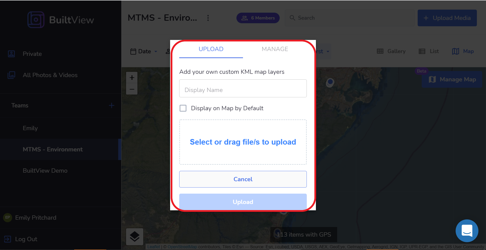
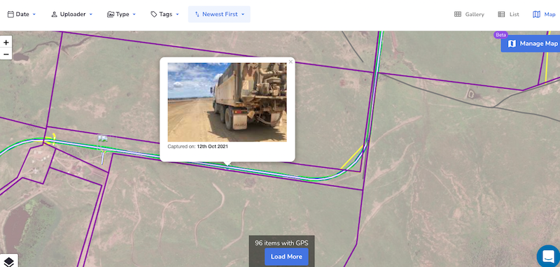
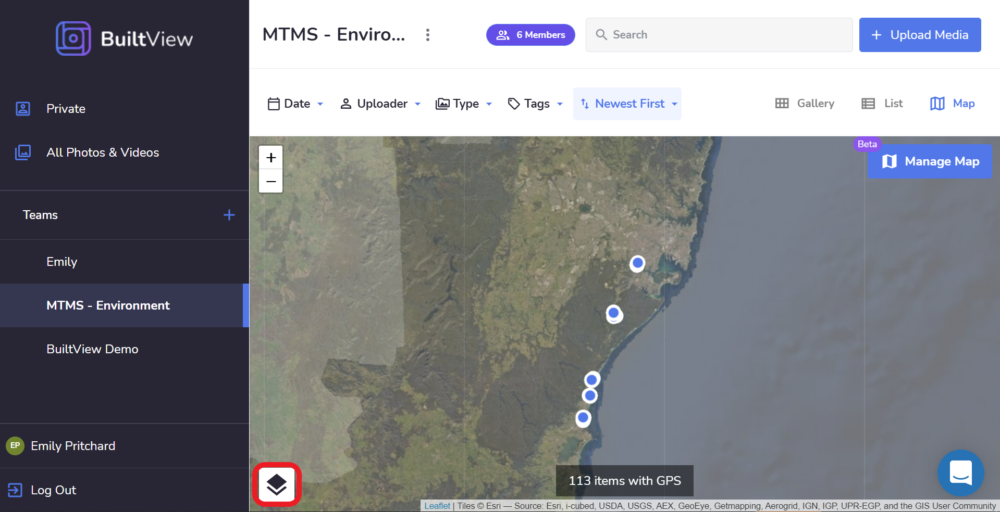

# Overlaying KML files on Map View

Constructions sites are very dynamic, with conditions onsite everchanging. Therefore as conditions change it can be difficult to keep track and visualise important elements of the site or scopes. 

With KML files the consistency of key site aspects such as underground services, overhead wiring, scope drawings, or design plans, etc can be captured & displayed alongside locations of content. Providing that extra piece of information & insight when viewing, sharing & managing all of your personal & team content in BuiltView. 

To add this additional context to your map view within a team or to individual files, go to the manage map function. 

Upload the custom KML file or files of your choice

Select the Display on Map by Default if you would like the KML file to be automatically shown in map view each time you open. 

Then transpose the KML file onto the map to denote the exact location. 

You can also change the map and layer features, using the layer function. Options to choose from include ArcGIS mapping, Near Maps & Street Maps. 

If you have any further questions regarding the KML file function or have any inquiries about other functions that could add value to your workflow, reach out to the BuiltView Team via Intercom on the left-hand side. 