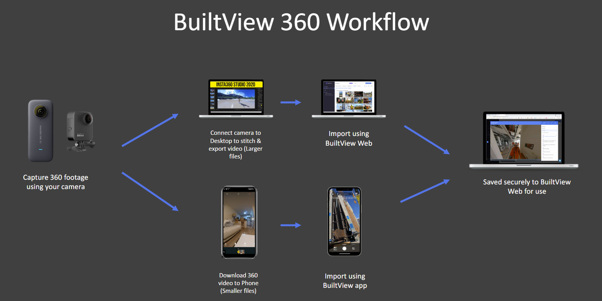
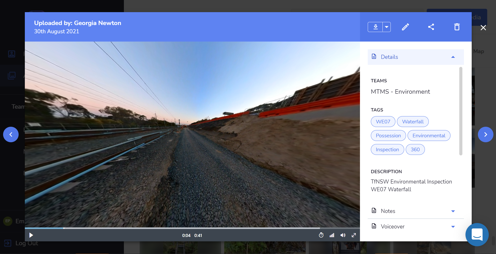

Using a 360-degree camera, a tour of the site can be conducted which captures all elements & conditions of the site. This allows for the whole story of the site to be conveyed to site teams, construction leaders, regulators, and clients through easily accessible & shareable video files.

## Functionality

When conducting a 360 tour using a 360 camera, the audience can gain both visual and audio insight & context about conditions onsite. 

The BuiltView website has a voice to a script function that allows discussions onsite during inspections/tours to be transcribed to text which makes it easy for the audience to understand & search the video for relevant sections and content. 

There is also a comments function that allows users to make comments & mention other users to grasp attention about particular sections shown in the video i.e. if a defect is captured or there is an erosion control that requires maintenance. 

The route covered during the 360 tour can also be documented for further context of the areas on-site covered. This route can also be transposed on a NearMap map or KML file to provide more insight for the audience & users. For more information regarding the route function please see "Creating a 360 Route" on BuiltView Support.

The content produced during a 360 tour is then easily uploadable to BuiltView.com where it can be managed, stored & shared with wider site teams & clients.  

## Recent Successes

The impact of COVID-19 restrictions & lockdowns on construction sites & offices has limited the accessibility to site, impacting the efficiency and effectiveness of communication and progression. 

During these times of limited site access, the team at MTMS implemented the 360 tour function on BuiltView to ensure that client environmental inspections could continue. During possession-based works a member of the MTMS Environment Team would conduct a site walk carrying the 360 camera (insta360), whilst providing commentary about the conditions onsite and scopes being carried out. The video captured by the 360 Camera was then uploaded to BuiltView.com, where it was then sent on to the client for their review, environmental actions & positive observations.

The 360 tour function that BuiltView provides was a very useful and impactful substitution for in-person inspections. It also allowed for more effective & transparent communication pathways between the contractor & client and proved efficient in documentation purposes. 

## How to get started

All you need is a BuiltView log-in and a 360 degree Camera! The 360 cameras that the BuiltView team recommends is the Insta360 and the GoPro MAX 360. 

If you have any questions or enquiries please reach out to the BuiltView team using the intercom pop up in the righthand corner of your screen. 