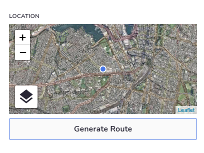
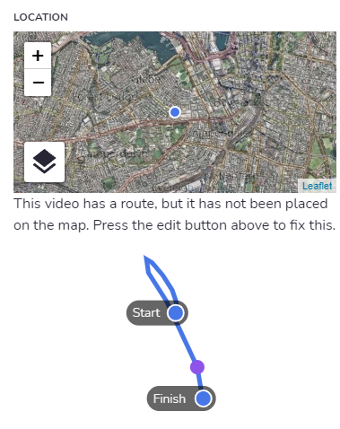
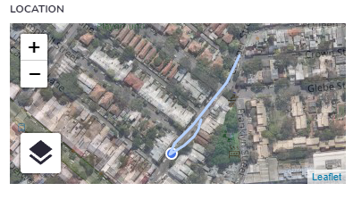

# Creating a 360 Route

BuiltView allows you to create walking or driving routes using 360 videos, to provide greater context. The route can even be used to navigate the video - it shows where you currently are, and by clicking anywhere on the route you can seek to that point in the video.

At the moment, generating a 360 route is an automated process which is started manually.

When viewing any 360 video, look at the "Location" section of the Details pane.  If a route can be generated but does not yet exist, you'll see a "Generate Route" button:

When you press this button, you should see an alert popup telling you that the processing has started.  We can't yet report on progress, or automatically refresh when complete, so you'll have to wait a little while for the route to generate (typically about 5-10 minutes, but it depends on the length and quality of the video).

The button will disable to keep you from pressing it again, but if you leave the video and come back, you will be able to press it again.  Please refrain from clicking the button multiple times, as it may cause problems on the backend.

When you come back and the route is generated, you should see it in that same Location section, and if the video already had a GPS location, it will show you a prompt to place the route on the GPS map:

Switch over to the Edit function (using the pencil icon in the top bar), and you can place the route on the map by clicking the start and end point - BuiltView will then scale and rotate the route until it fits those two points.  This can be a little tricky to get right, so you can keep trying until it's correct, and then save.

Anyone who views that video will then be able to see the path the camera took on the map, and navigate the video using the map.

