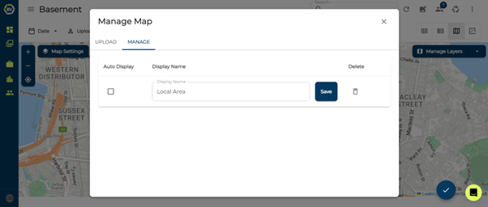

# KML Maps

Constructions sites are very dynamic, with conditions onsite everchanging. Therefore, as conditions change it can be difficult to keep track and visualise important elements of the site or scopes. 

With KML files the consistency of key site aspects such as underground services, overhead wiring, scope drawings, or design plans, etc can be captured & displayed alongside locations of content. Providing that extra piece of information & insight when viewing, sharing & managing all your personal & team content in BuiltView. 

To add this additional context to your map view within a team or to individual files, follow the steps below.

1)	Click Manage Layers at the top right of the map view

2)	Add a display name and upload the custom KML file or files of your choice.

3)	Select Auto Display if you would like the KML file to be automatically shown in map view each time you open it.

4)	The KML file should automatically be displayed on the map in the correct location

5)	Change the map and layer features, using the layer function.

6)	Edit the name or delete a KML map by clicking Manage Layers and switching to the ‘Manage’ Tab

