# Floorplans

The floorplan feature in BuiltView is designed to help you localise your visual data in situations where GPS is unusable or insufficient - for example, when working underground or on multi-level vertical builds.

You can upload floorplans to any team if you have sufficient permissions, and each team can have multiple floorplans, so you can have a separate file for each level of a building for example.
Currently, floorplans are supported as image files or as PDF files - in the latter case, only the first page of the PDF will be used to render the floorplan image.

Media items can then be allocated to specific locations on particular floorplans, and you can view your photos in the same way as you can on a map using GPS locations.

## Uploading Floorplans

Follow the steps below to upload your floorplan from the website application.

1)	Go to the team settings, accessible at the top right of the team gallery page.

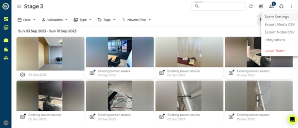

2)	Switch to the ‘floorplan’ tab in settings.

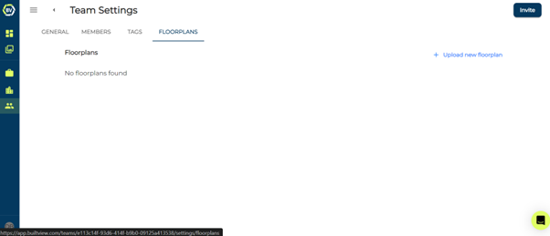

3)	Click ‘Upload new floorplan’ button.

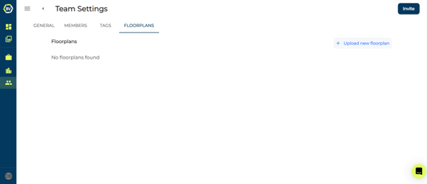

4)	Enter the title and additional information as needed, such as a description or version number before continuing.

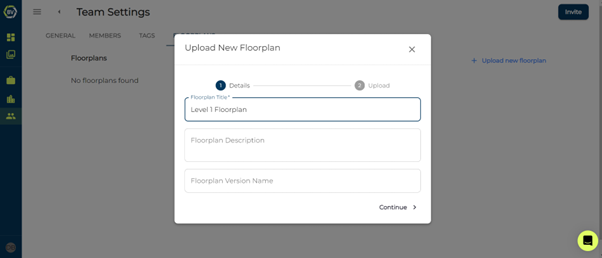

5)	Upload a PNG, JPEG or PDF file and click upload. The first page of a .pdf file is used as the floorplan.

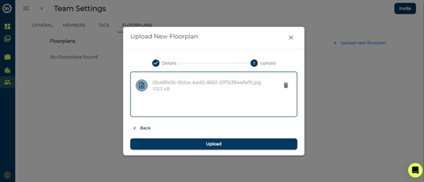

You should now be able to access your floorplan both in the team settings on the ‘floorplan’ tab and in the floorplan gallery view. Keep reading to see how to set floorplan locations on existing and new media items.

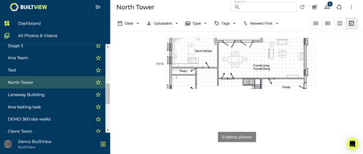

## Setting Floorplan location - Desktop

Follow these steps to learn how to set a location on a floorplan to existing media items on desktop.

1)	Select the team you uploaded the floorplan into.

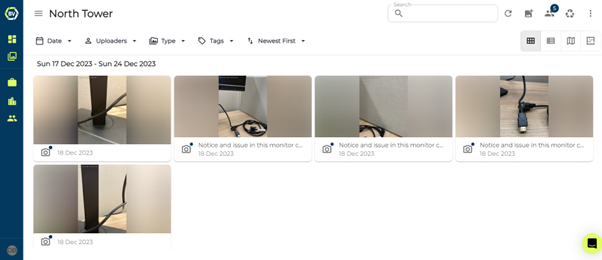

2)	Select a media item to set a location on the floorplan.

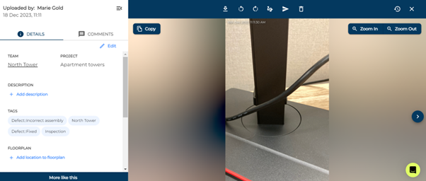

3)	Click ‘Add location to floorplan’ under the Floorplan subtitle in the details panel

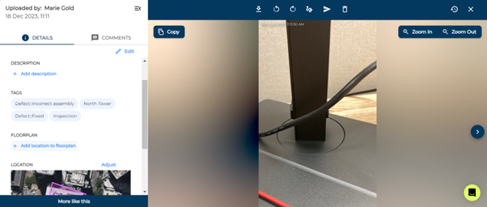

4)	Select the floorplan by opening the input box.

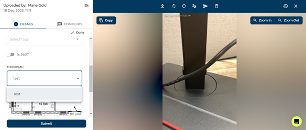

5)	Hold and drag to move around the floorplan and click to set the location.

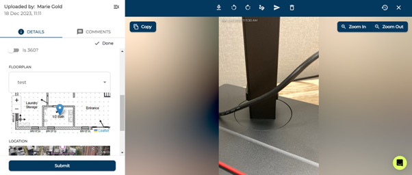

6)	Click Submit or Done to save the changes. 

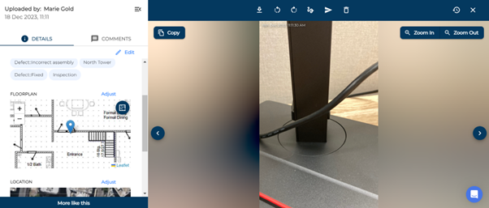

## Setting Floorplan location – Mobile

The steps above for setting floorplan location to existing media items is the same on mobile and desktop. You need to add the floorplan location in the media details panel. 
On mobile, you can capture content with the floorplan location already set! Follow the steps below to learn how.

1)	Select the team with the floorplan uploaded on the camera page on mobile.
2)	Click the floorplan icon and click to pinpoint the location of your capture.
3)	Save and start capturing!

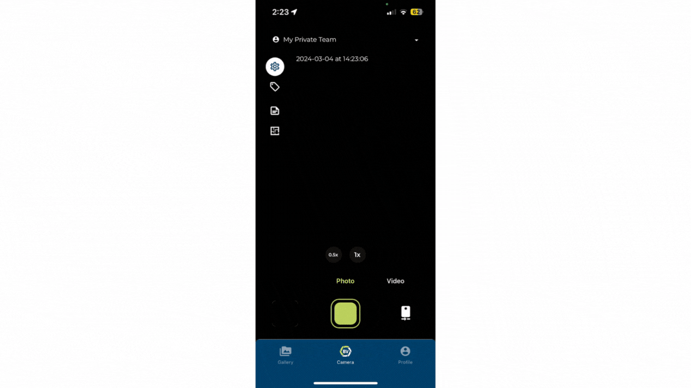

