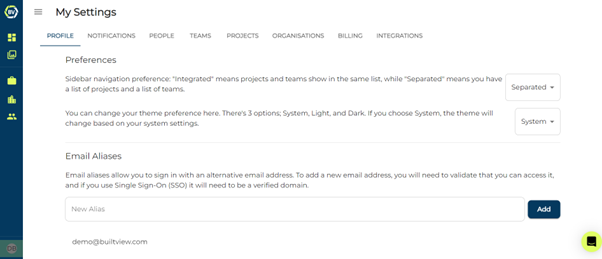
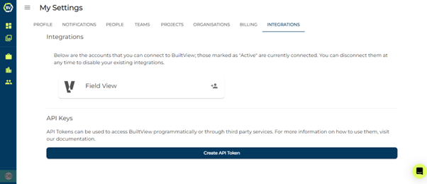
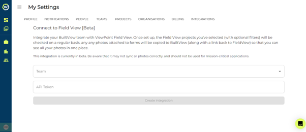
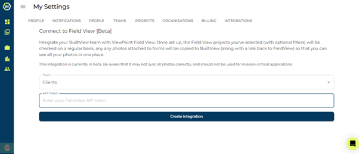

You are able to integrate Fieldview with Builtview to streamline your processes.

1)	Go to your profile accessible at the bottom of the side navigation menu.

2)	Click the ‘Integrations’ tab.

3)	Click on the Field View integration option.

4)	Select a team and add the Fieldview API token and click create

### Conclusion

Integrate Fieldview to streamline your construction processes with Builtview.