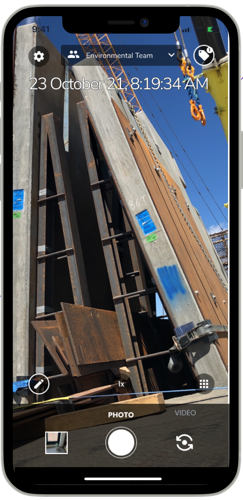

When you first download and start up Builtview, the app will show you the basics on how to use the application! You can reset app tours in your profile settings to revisit them. To get the most out of Builtview mobile check out the article collection [Mobile Help](https://https://support.builtview.com/mobile-help/1capturing/)

## Getting Started

To get started download the BuiltView app, which is accessible on both the [App Store](https://apps.apple.com/us/app/builtview-mobile/id1560750101) and [Play Store](https://play.google.com/store/apps/details?id=com.builtview.mobile.dev&hl=en_GB&gl=AU).

Once the app is installed, set up an account using your email address.

When logged in you're ready to start capturing, sharing & uploading content.

## Capture

When taking photos and videos, the BuiltView app provides functions to allow for further context & insight to be recorded and shared.

These functions include:

* **Tags**; short phrases attached to content that can be used to sort & filter.
* **Description**; tell the story of the image through a few words.
* **Location**; capture the exact place the content was captured.
* **Timestamp**; watermarked on the image, the exact time of capture, approx. street address, GPS coordinates, direction.
* **Teams**; share directly with your teammates.

To streamline the process of providing context through tags, descriptions, and teams use the pre-selection function. This ensures that all photos & videos taken include the details specified by you, this can be edited on images at a later stage if needed.