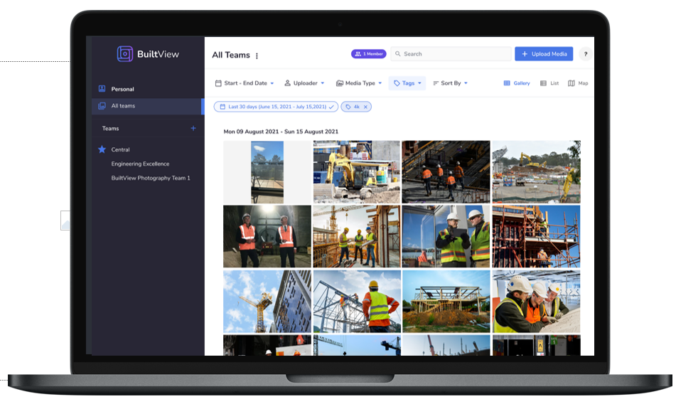
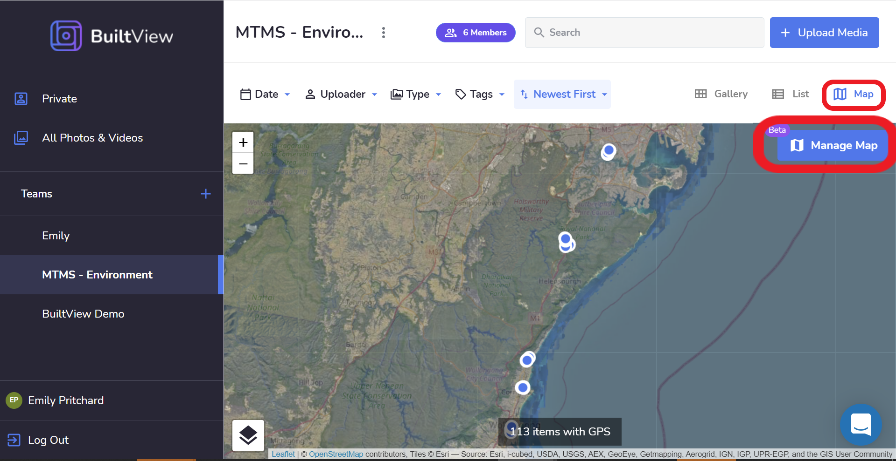
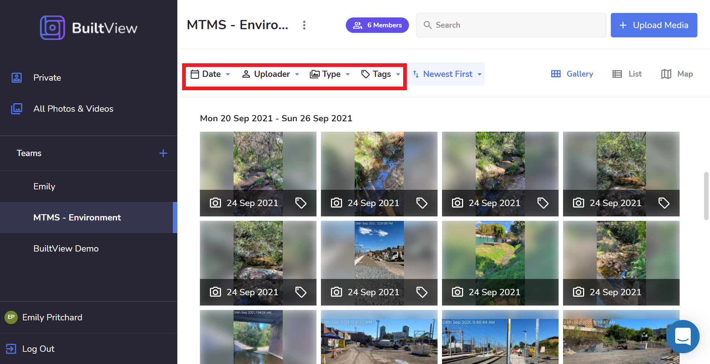
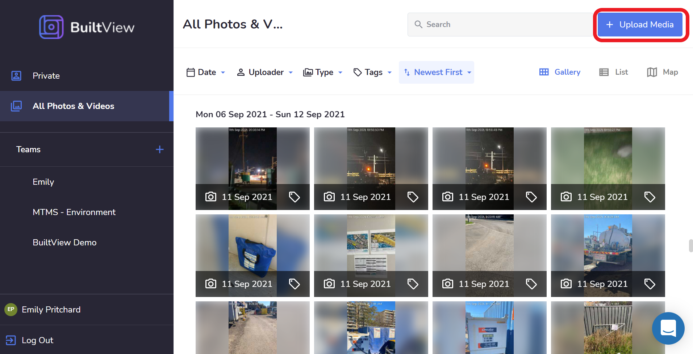

To get started go to [Builtview.com](https://builtview.com) and set up an account using your email address.

The website function of BuiltView lets you visualise, manage, store and access your content taken onsite.

## Reports

Creating neat daily site reports to presentations for clients, BuiltView's smart and customisable report feature can be found on the website.

Find out all about reports by searching "Reports" in the article search.

## Map Overlays & KML Files

When the BuiltView app is used to capture content onsite it will record the GPS coordinates & location. The locations that content has been created can be visualised and overlaid on built-in NearMap maps. A new function that many teams have found useful is the overlay function of KML files, which allows KML maps/markups to be transposed against locations of photos to provide further insight and context.

## Sorting and Sharing

Through filters such as tags, date of capture, content type, and the uploader. The files on a team, in your private files, or all files can be sorted, searched, and downloaded. This makes the arduous task of documentation & content management efficient & effective. The multi-select button makes the collation of content & downloading of large groups of items easy. So that files & content can then be saved on project servers if needed, though BuiltView stores all data on long-term enterprising platforms meaning it's there forever!

## Uploading

If you're new to BuiltView and would like to have all your previous photos & videos in one place, you can upload all of your content to BuiltView!

This can be done on your mobile, to upload photos & videos from your phone gallery. Uploading content can be also be done on the BuiltView website, by uploading files from your personal archives or the project server.

