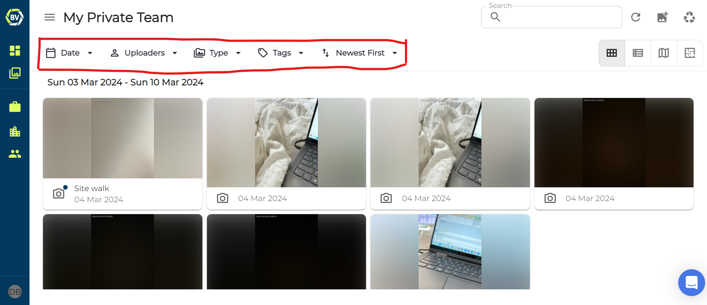
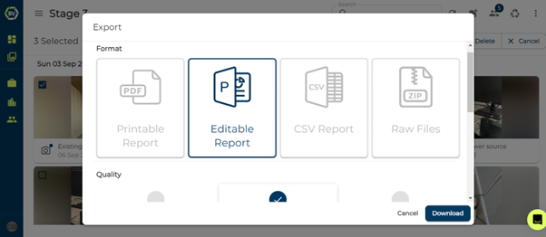
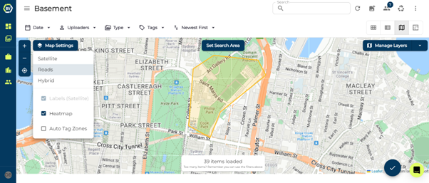
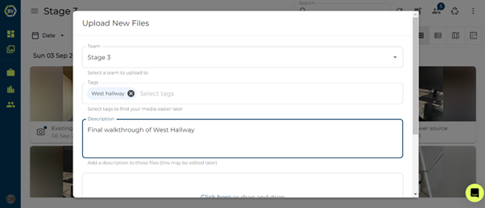

To get started go to [Builtview.com](https://builtview.com) and set up an account using your email address. The website function of Builtview lets you visualise, manage, store, and access your content taken onsite.

For a full comprehensive guide to learn everything that Builtview has to offer explore our support articles! 

## Sorting and Sharing

Through filters such as tags, date of capture, content type, and the uploader. The files on a team, in your private files, or all files can be sorted, searched, and downloaded. This makes the arduous task of documentation & content management efficient & effective. The multi-select button makes the collation of content & downloading of large groups of items easy. So that files & content can then be saved on project servers if needed, though BuiltView stores all data on long-term enterprising platforms meaning it's there forever!

You can also change how media is displayed, by default Gallery is selected, but you can also view your media in a list, on a map or on a floorplan if you have added one.

## Reports

You can quickly make neat daily site reports as presentations for clients. Builtview’s smart and customisable report feature can be accessed once you have selected multiple media items within a team, showing the option to ‘Export’ where you can customise the type of report and what is included. To learn more about this check out the [Report and Exports](https://?) article in the Media Basics collection. 

## Map Overlays & KML Files

When the Builtview app is used to capture content onsite it will record the GPS coordinates & location. The locations of media content can be visualised and overlaid on KML maps. To learn more about this check out the KML Maps article in the Advanced Features article collection.

## Uploading

If you’re new to Builtview and would like to have all your previous photos & videos in one place, you can upload all your content to Builtview!

This can be done on your mobile and desktop with ‘import.’ You can import multiple photos at once. Select the team and add tags and/or descriptions before importing.

