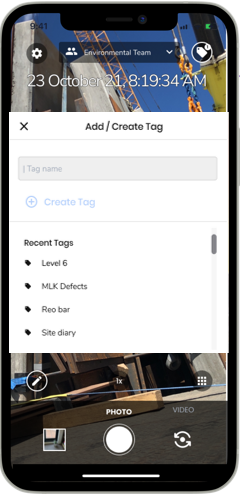

_An effective & efficient construction team relies heavily upon good quality, well-kept & easily accessible documentation. It is understood that every week approximately 6,000 photos are taken daily, of these only 1,500 are saved & shared onto project servers, therefore 75% of photos are not accessible. BuiltView addresses this problem by automating the tedious process of uploading, organising & saving content and also allows users to add more context & detail to their photos and videos. Freeing up the precious time of site teams and ensuring that the documentation process is stress-free._

**BuiltView is the dedicated camera app for construction teams.**

BuiltView has been developed with input from active site teams to ensure it caters to & keeps up with the demands that construction teams face when capturing, sharing & managing onsite content. 

The app is designed to replace your phone camera, to capture and document onsite activities which are automatically uploaded to [BuiltView.com](https://app.builtview.com/) and can be shared with your selected work teams.

Builtview’s functions adds value to your content. Through tags to provide more context, descriptions to tell the story, location to provide insight, and floorplans to visualise progress. Builtview has the capability to view and overlay content on a map with custom project layers like Nearmaps and KML site plans, you can export photos as customisable presentations or reports with dates, uploader, tags and descriptions. 

Incorporating Builtview for site teams saves hours a week searching through media and creating site reports. Builtview saves money by settling disputes and preventing unnecessary site visits. Builtview increases the efficiency and effectiveness of onsite photo record management.

Read through some of the articles for more information & guidance on setting up & getting the most out of Builtview.
