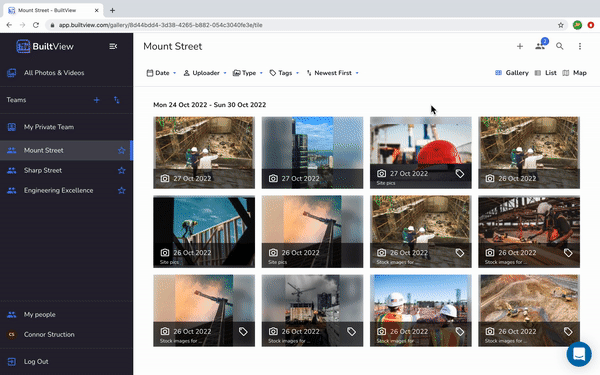

# How to upload Media

## Web

1. Click the 'Upload Media' button in the top right corner. 
1. Select the team you want your media to end up in and add a description and some tags. 
1. Drag or navigate to your files and hit 'Upload'. 

## Mobile

1. From the team you want to add photos or videos to, tap the '+' icon in the top right corner. 
1. Select media from your phone gallery, add a description and tags (which will be attached to all selected media) and tap 'Import'. 

!!! note
    Images will be associated with their creation date, not the upload date. 