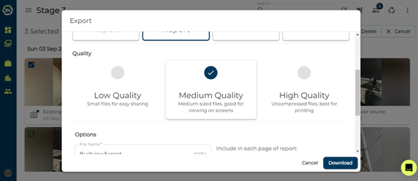

# Bulk Selection

Bulk selection refers to the actions you can complete when you have selected multiple media items at once. Bulk selection makes it easier to edit the tags and descriptions, delete, move, or copy to another team and lets you create site reports. 

1)	To select a media item, hover over it in your team and click the checkbox at the top corner.

2)	The options are the top of the screen will change, replacing the filtering options. You should see buttons such as Export, Edit, Delete, Move and Copy.

## Exports and Reports

Export allows you to download the file selection however you like, this can be either as raw jpeg files, a presentation or report which are all customisable. Read the full article Reports and Exports for an in-depth explanation of the customisable options and more.

1)	Select your media items and click export.

2)	Choose the type of export including a PDF, PPTX, CSV and ZIP

3)	Choose the file Quality

4)	Customise any properties as needed (this is dependent on which type of export you choose)

## Changing media information in bulk

If you accidentally forget to remove tags and descriptions before you start capturing again. You can easily overcome this with Bulk selection edits with options append, overwrite or delete.

1)	Select your media items and click edit

2)	Choose Append, Overwrite or Delete.

3)	Enter tags and descriptions that you want to append, delete or overwrite.

4)	Click save and the changes will be applied to the media items

## Move and copy in bulk.

If you accidentally upload your content to the wrong team or need a copy of some media items in other teams you can move or copy multiple media items. Moving them will remove them from the current team.

1)	Click on move or copy once you have made your selections. Move will mean the items will no longer exist in your current team.

2)	Select the team to move or copy the media items to.

## Rotating

Taking photos in landscape is sometimes necessary to capture all the information, however this makes it harder to view them later. Easily rotate your photos without having to individually edit them.

## Delete

You or your team may accidentally upload photos that clutter and disorganise your photo records. Delete all unnecessary media items quickly in bulk.

Learn how to do this on mobile in the [Mobile help](https://support.builtview.com/mobile-help/6bulk-selection) article collection