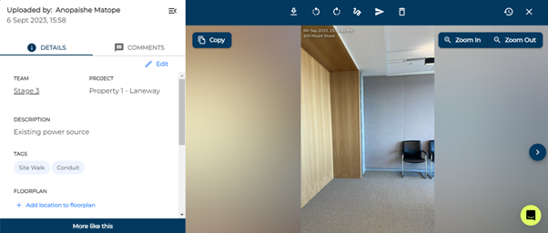
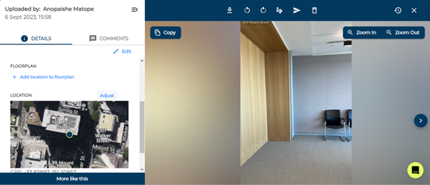

# Changing Media Information

You can edit the tags, description, team, and GPS coordinates for media items when you click on them. 

1)	Click on the media item you want to edit.

This should open a new page with an information and comments panel on the left of the screen. By default, the details panel should be selected. This shows you the uploader, date, team, associated project, description, tags, floorplan, and GPS Location. From this page, you are also able to download, rotate, copy, markup, share, delete, view media history and edit media contents.

2)	Click ‘Adjust’ on location to change coordinates or ‘add floorplan location’ if one isn’t added.

3)	Click the edit button to change the tags, description, and photo location.

4)	Make your changes and click ‘done’ to update the media item with these changes.

### Conclusion

You can change all parameters except GPS and Floorplan on multiple media items at once. Learn how in [Bulk selection](https://support.builtview.com/media-basics/bulk-selection/) article.

Learn how to do this on mobile in the [Mobile help](https://support.builtview.com/mobile-help/changing-media-info/) article collection
