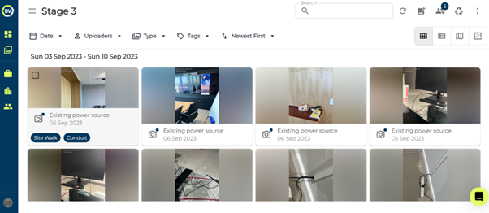

# Deleting Media

Deleting a media item can be done in bulk or individually in Builtview. To learn how to delete multiple media items at once look at this article.

1)	Click on the media item you wish to delete.

2)	Click the ‘trashcan’ icon at the top right of the screen.

3)  Confirm

### Conclusion

On desktop, you are still able to view and recover deleted media through checking the recently deleted files within your teams. You are also able to delete multiple media items at once, check out the [Bulk selection](https://support.builtview.com/media-basics/bulk-selection) article to learn more.

Learn how to delete media on mobile in the [Mobile Help](https://support.builtview.com/mobile-help/9deleting) article collection.
