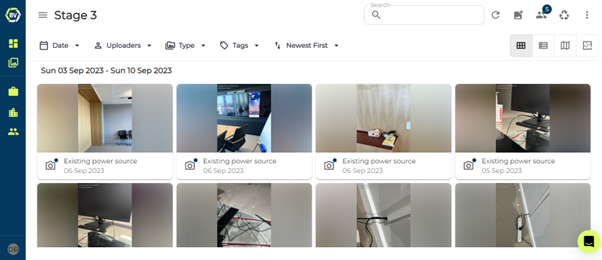
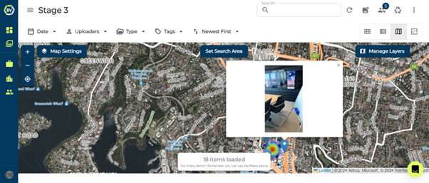

You can filter or search from the following metrics on desktop on your team gallery page. If used properly and set up well, filtering by tags is a great way on locating media.
-	Searching: search to see media items with a similar description
-	Tags: filter by a selection of tags with and/or options.
-	Uploaders: search based on the member that uploaded in your team
-	Date: Limit your search to a date range
-	Sort by: Changing the sorting of media by newest or oldest first.
-	Type: search through media by the type, either photo, video, 360 photo or 360 video.
-	Deleted Media: find deleted media.

You have four options you can choose from with how media is displayed. By default, gallery is selected (see above), but you can also choose from list, map, or floorplan.

### Conclusion

The filtering capabilities in Builtview is what sets us apart. Tags are particularly valuable as they are quick to apply during site visits and easy to find. To learn how to do this on mobile check out the Mobile Help article collection.
