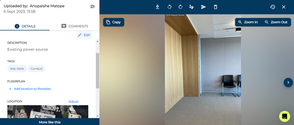

# Markup and Annotating media

Sometimes photos need some adjustments so you can see details more clearly, you can do this all in Builtview! You can add text, crop, rotate, draw, change brightness and much more.

1)	Click on the media item you wish to annotate or edit.

2)	Click on the squiggly line icon at the top of the screen.

3)	Make changes by cropping, rotating, annotating, or blurring your media.

4)	Click ‘done’ and you’ll have your original image as well as your marked up version in your gallery.

### Conclusion

Builtview lets you markup, adjust lighting and annotate media items to provide necessary context and highlight important components of your captures to increase the value of photo-based evidence.

Learn how to do this on mobile in the [Mobile help](https://support.builtview.com/mobile-help/markup/) article collection.