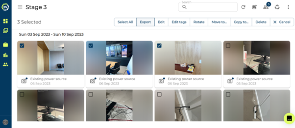
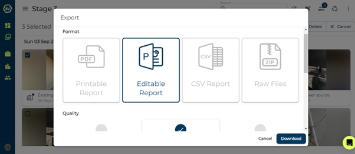
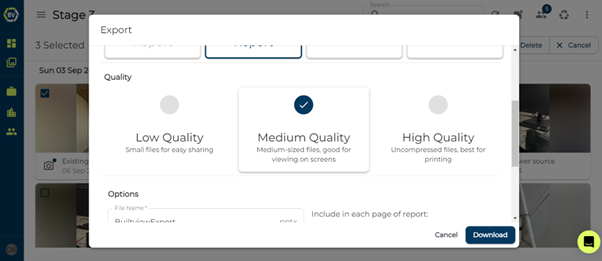
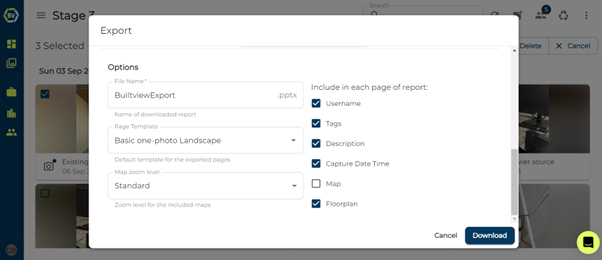
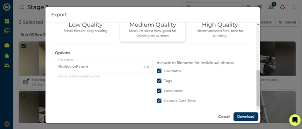

Customisable site reports and exports are a valuable time saving features part of Builtview making it easy to share with your team and clients. You can choose the type of export, quality, and what is included in the export.

1)	Select your media items and click the export button.

2)	Choose the type of export.

You will be given multiple options for the type of exporting, including:

-	PDF: Printable Report

-	PPTX: Editable Report

-	CSV: CSV Report

-	ZIP: Raw media items

3)	Choose the file quality.

From this, you can choose the file quality:

-	Low Quality: small files for easy sharing.

-	Medium Quality: Medium-sized files, good for viewing on screens.

-	High Quality: uncompressed files, best for printing.

4)	Customise the export.

Each Export lets you choose the name before you download. 

The PPTX and PDF reports lets you customise what the report looks like to fit your needs, you can customise:

-	Page Template 

-	Map Zoom Level

-	What contextual information to include about each media item in the report:

    o	Uploader

    o	Tags

    o	Description

    o	Capture Date Time

    o	Map 

    o	Floorplan

The ZIP file lets you include additional information in the filename for the individual photos:

-	Uploader

-	Tags

-	Description

-	Capture Date Time

5)	Download

Once you have chosen the type of export that fits your needs and customise the output as needed simply click download!

### Conclusion

Exports are a valuable way to quickly generate shareable and informative site reports that are customisable to fit your needs.
