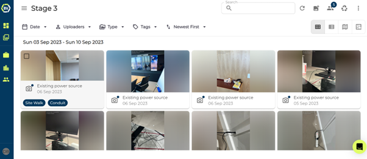
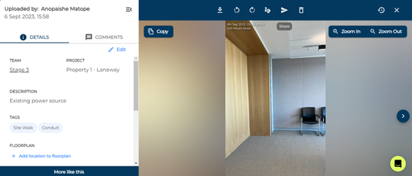
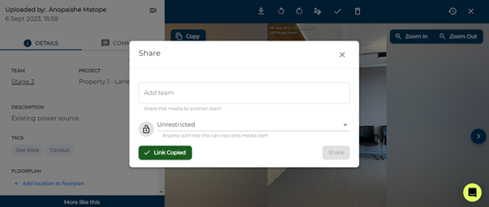
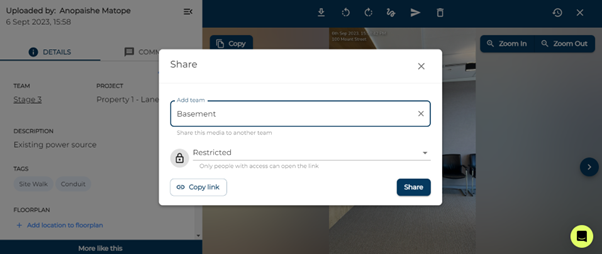

You can invite guests to share your team content from within BuiltView, or you can send specific content to others outside of BuiltView through sharing. Share content of the whole team by inviting the guest to them. 

1)	Click on the media item you want to share.

2)	Click the share button at the top of the screen.

3)	Change the restriction of the item and copy link.

4)	Alternatively, select a team and click share.

### Conclusion

Sharing can be important for sending media items to clients. To protect your content, you can restrict the link accessibility. This means only users with access to the team can access the link. As an alternative way to share multiple media items to clients you can export them.

Learn how to share on mobile in the [Mobile Help](https://support.builtview.com/mobile-help/sharing) article collection.