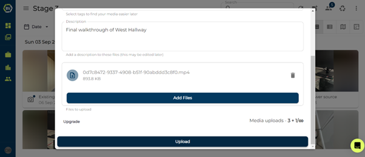

# Uploading Media

Uploading media allows you to have all onsite photos in one place.

1)	Click on the team you want to import media into and click the upload button at the top right of the screen.

2)	Add tags and description to help organise the files as you wish.

3)	Click or drag and drop files into the input box.

4)	Click upload.

### Conclusion

It is important to have a complete and full record of onsite photos integrated into Builtview. This creates a central repository for all onsite photos and allows accessibility for all users in your team. 

Check out the [Mobile Help](https://support.builtview.com/mobile-help/uploading-media/) article collection to learn how to do this on mobile!