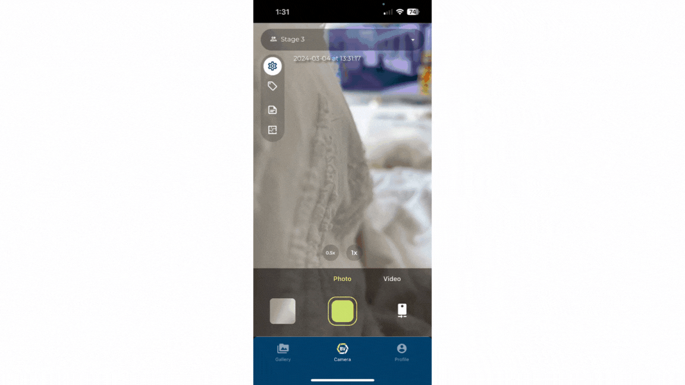

# Creating a team

Teams are an effective way of keeping track of onsite progress. If you have a large project, you can separate and organise progression throughout multiple teams and connect it in a project.

1)	Go to the gallery page and click the ‘+’ icon on the right of the Teams title. 
2)	Create a recognisable name for your team.
3)	Optionally, allocate your team to a project.
4)	Create your team.

### Conclusion

The process for creating a team on mobile is slightly different then on desktop, you are unable to set tags and invite users initially. Learn how to invite users on mobile. In order to create tags, you need to go to the camera page, select the new team and type the name of your tag in the tags pop-up and click create. Managing and setting up teams is easier on desktop. 

Check out how to [Create a team](https://support.builtview.com/teams-and-projects/2creating-team/) on desktop.
