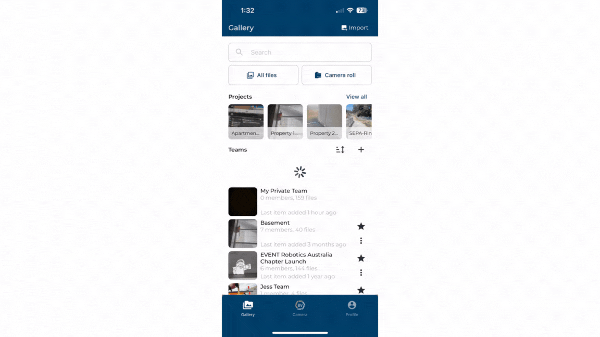

Invite people to your team and start building a comprehensive photo record.

1)	Access the team settings from your list of teams or the team gallery.

2)	Click invite. 

3)	Choose to invite users by sharing an invite link, from your contacts, a QR code or by email.

4)	To share by email, enter the email address of who you want to invite and click the plus button. You can add multiple members this way.

5)	Once you have added all the email addresses, click the send button at the top.

### Conclusion

Inviting users on desktop and mobile shows slightly different options. On mobile, you can use your phone contacts, share links or QR codes as alternative ways to invite your users!

Learn how to [invite users](https://support.builtview.com/teams-and-projects/3inviting-users/) on desktop.
