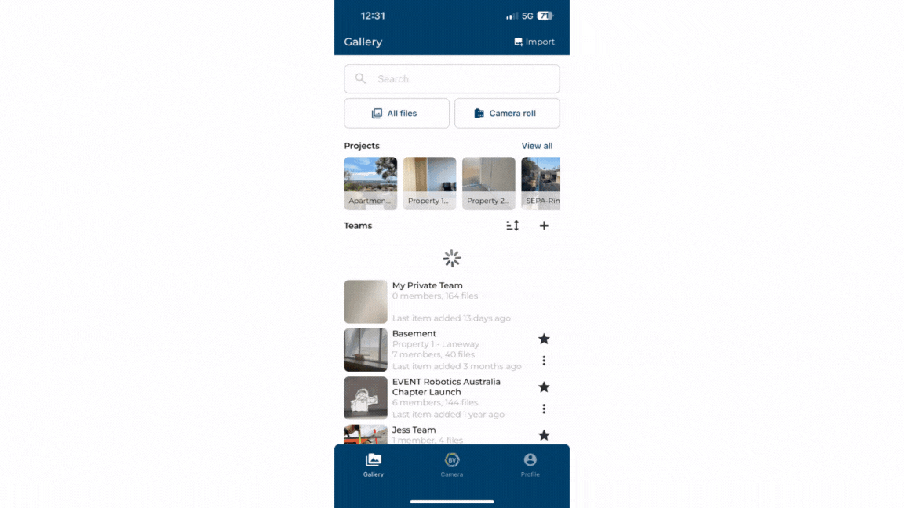

If you have photos on your camera roll that needs to be organised and kept in your team records, you can do this easily with Builtview.

1)	On the gallery page click the import button at the top right of the page. You can also import in your team gallery by clicking the three-dot menu.

2)	Select the files you want to import. 

3)	Select the team you want the files to be in

4)	Categorise these photos with tags and descriptions.

5)	Click import once you are done.

### Conclusion

It is important to have a complete and full record of onsite photos integrated into Builtview. This creates a central repository for all onsite photos accessible by all members on your team.

You can also edit the GPS location and set a floorplan location for these photos once they have been uploaded, see [changing media information](https://support.builtview.com/mobile-help/7changing-media-info) article for mobile to learn more.

Learn how to [import](https://support.builtview.com/media-basics/uploading-media/) on desktop.