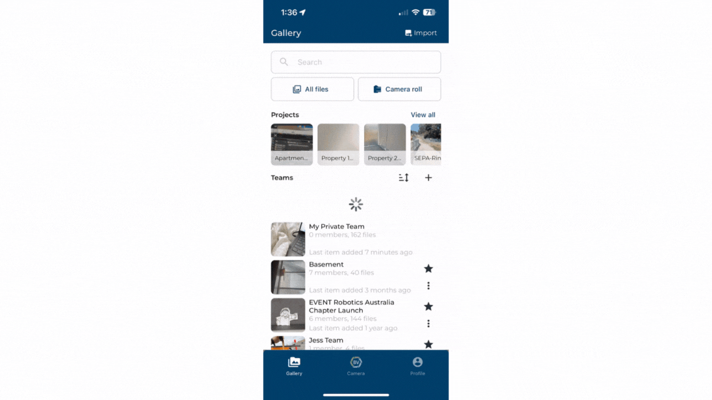
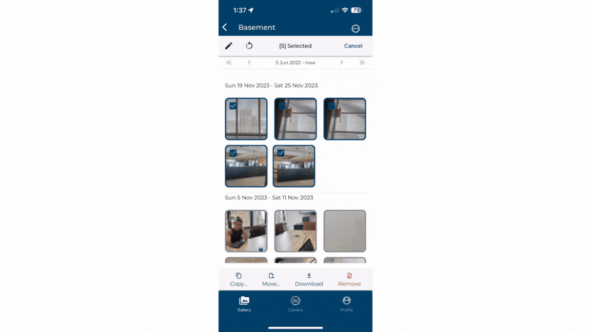
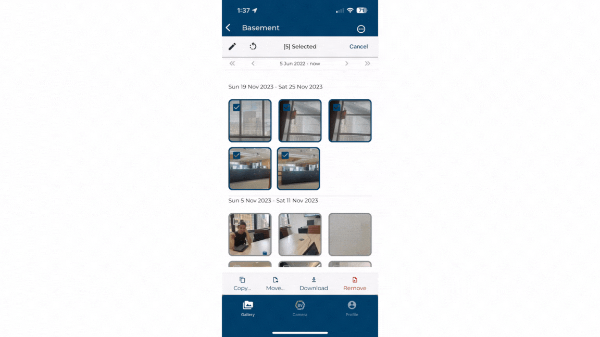
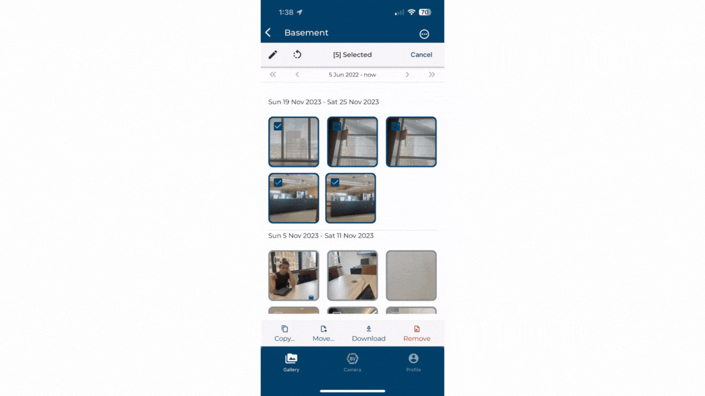
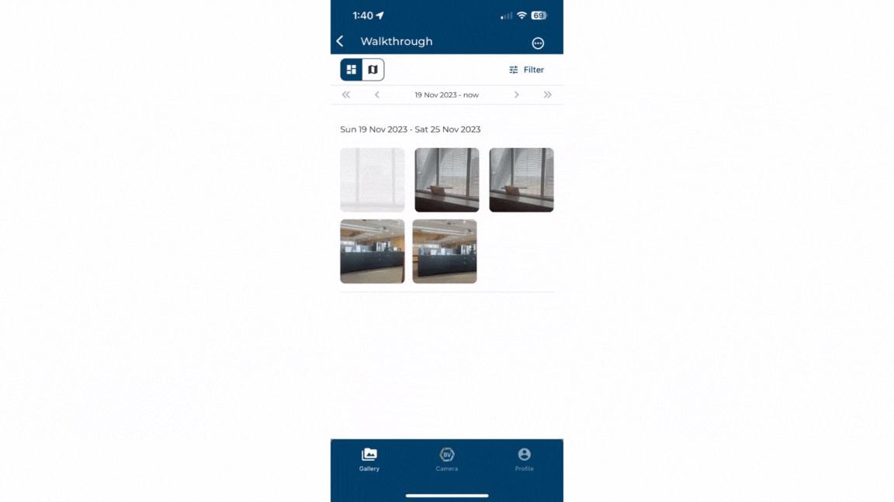
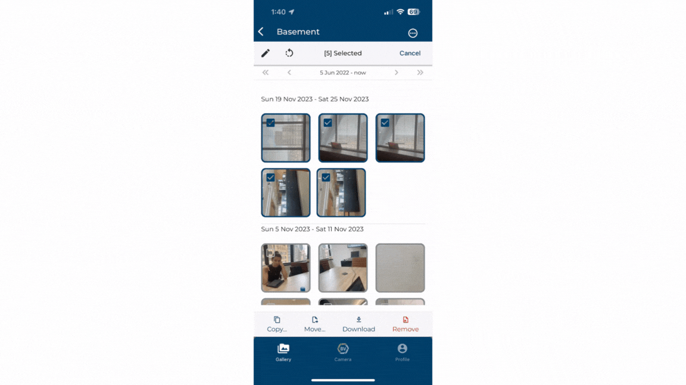

Bulk selection refers to selecting multiple media items at once. Bulk selection makes it quicker and easier to make edits to tags or descriptions, deleting, copying, and downloading media.

1)	Press and hold down on an image in your team galleries to select it. Once you have selected you can just click to select more items.

2)	You should see these options, including delete, copy, move, edit, and rotate.

## Changing media information in bulk
If you accidentally forget to remove tags and descriptions before you start capturing again. You can easily overcome this with Bulk selection edits with options append, overwrite or delete.

1)	Click the ‘draw’ icon once you have made your selections.

2)	Choose to Append, Replace or Delete as options.

3)	Input a description and tags you want to append, replace or delete on the media items.

4)	Click save for the changes to apply.

## Move and copy in bulk.
If you accidentally upload your content to the wrong team or need a copy of some media items in other teams you can move or copy multiple media items. Moving them will remove them from the current team.

1)	Click on move or copy once you have made your selections. Move will mean the items will no longer exist in your current team.

2)	Select a team to move or copy the media items to

## Rotating
Taking photos in landscape is sometimes necessary to capture all the information, however this makes it harder to view them later. Easily rotate your photos without having to individually edit them.

## Delete
You or your team may accidentally upload photos that clutter and disorganise your photo records. Delete all duplicates or unnecessary media in bulk.

## Download
Download relevant media files in bulk to have them easily accessible in your phone’s camera roll and share them easily. On Desktop, you are able to make customisable reports as presentations which can be useful for sharing with clients as a better way to share onsite photos.

### Conclusion

Bulk selection allows you to swiftly make changes to multiple files, making it easy to categorise media or recover from errors such as wrong team placement. 

Learn how to use [bulk selection](https://support.builtview.com/media-basics/bulk-selection/) on Desktop 
