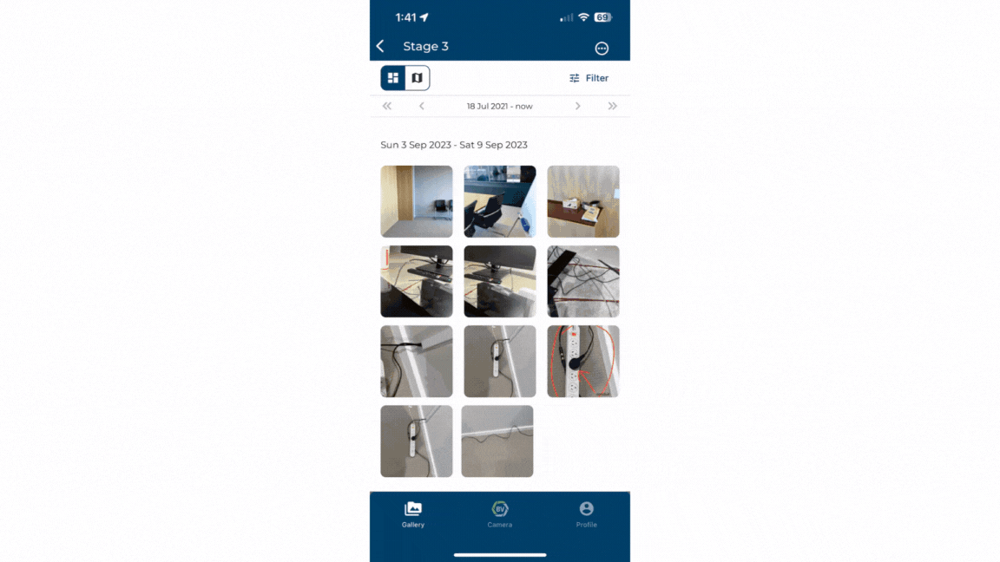

# Changing Media Information

You can edit the tags, description, team, and GPS coordinates for media items when you click on them. 

1)	Click on the media item you want to edit.
2)	Press the ‘information’ icon on the left at the top.
3)	Click + add or edit or move text buttons next to each information field to edit.
4)	Click save to update the media item with these changes.

### Conclusion

You can change all parameters except GPS and Floorplan on multiple media items at once. Learn how in [Bulk selection](https://support.builtview.com/mobile-help/6bulk-selection/) for mobile article.

Learn how to edit [media information](https://support.builtview.com/media-basics/changing-media-info/) on desktop.