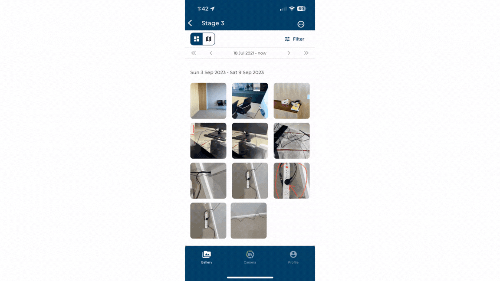

Annotating media items helps add important context and highlight elements which can help you and your team down the line. You can crop, rotate, annotate, add text and more. You can also edit the brightness and contrast if it is difficult to see those key details. 

1)	Click on the media item you want to annotate.

2)	Press the draw icon at the top of the screen.

3)	Make changes from cropping, rotating, annotating or blurring your media.

4)	Press the tick button at the top right and you’ll have your original image as well as your marked up version in your gallery.

### Conclusion

Builtview lets you markup, adjust lighting and annotate media items to provide necessary context and highlight important components of your captures to increase the value of photo-based evidence.

Learn how to [markup and annotate media](https://support.builtview.com/media-basics/markup/) on desktop.