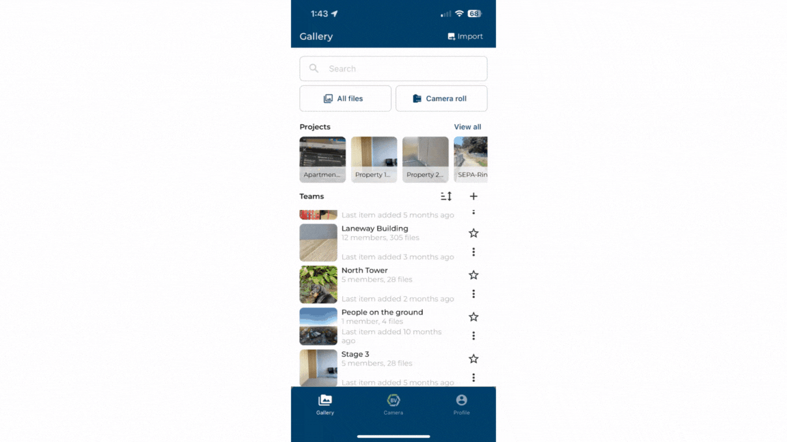

# Deleting Media

Clean up your documents by deleting irrelevant media items or duplicates.

1)	Click on the media Item you want to delete.
2)	Press the trash can icon at the top right of the screen.
3)	Confirm 

### Conclusion

You can also delete media through selecting it from the team gallery, check out the [Bulk selection](https://support.builtview.com/mobile-help/6bulk-selection) article for mobile.

Learn how to [delete media](https://support.builtview.com/media-basics/deleting/) on Desktop. 
