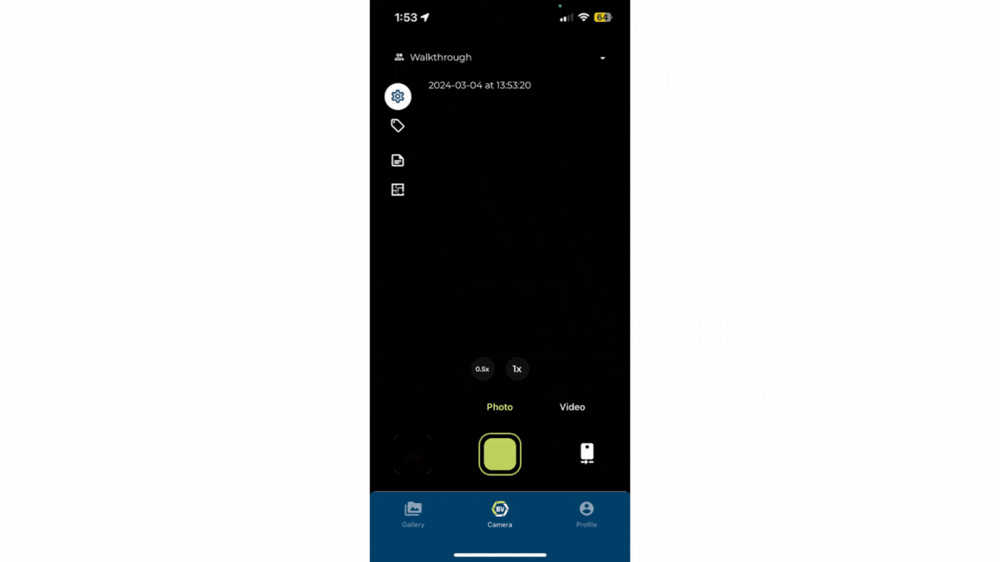
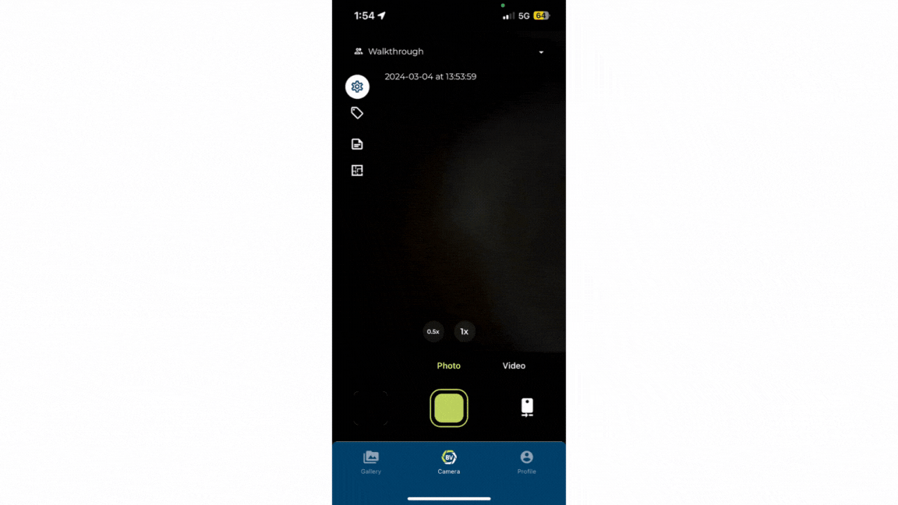

Some sites have inconsistent internet connections; therefore, we have developed our application to work around limited to no internet connection. When internet connection is re-established, the application automatically begins uploading all captures in the background, however this may prevent you from carrying out other task which take higher priority. 

Hence, we have added the ability to pause downloads and only upload on Wi-Fi. 
There are two ways to set this up, through the uploading progress panel or through settings. 

Activating ‘Only upload on wi-fi’ is only accessible in settings whilst ‘Pause uploads’ can be accessed from either.

### Conclusion
Pausing uploads caters to onsite teams in rural locations, improving their experiences by preventing background uploads, which slows down their connection impacting their ability to carry out other tasks.
