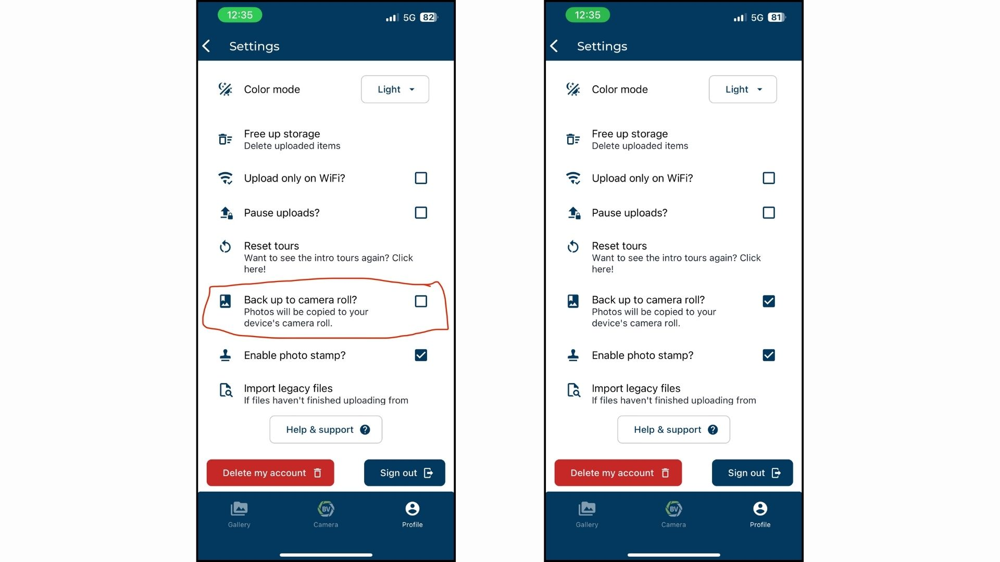
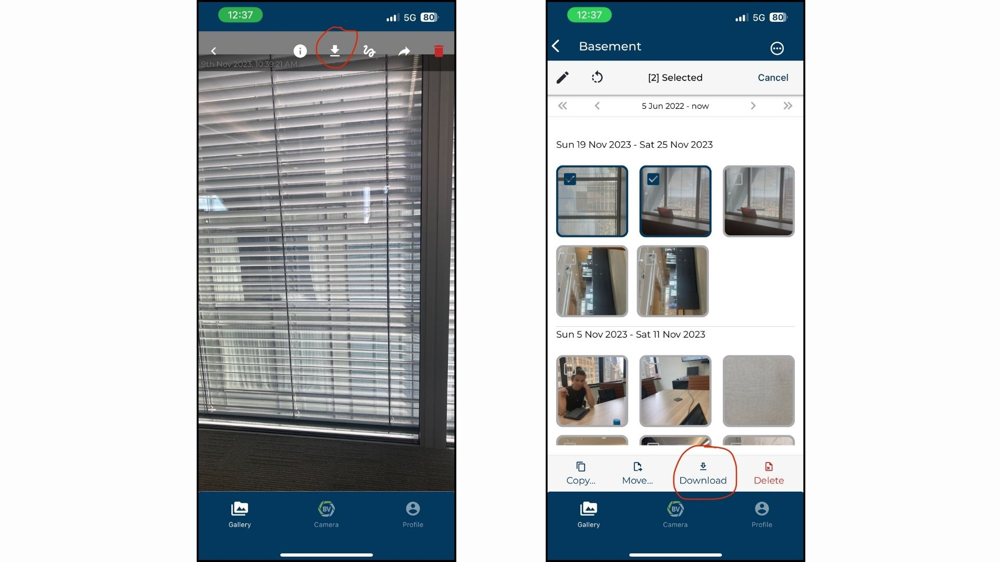
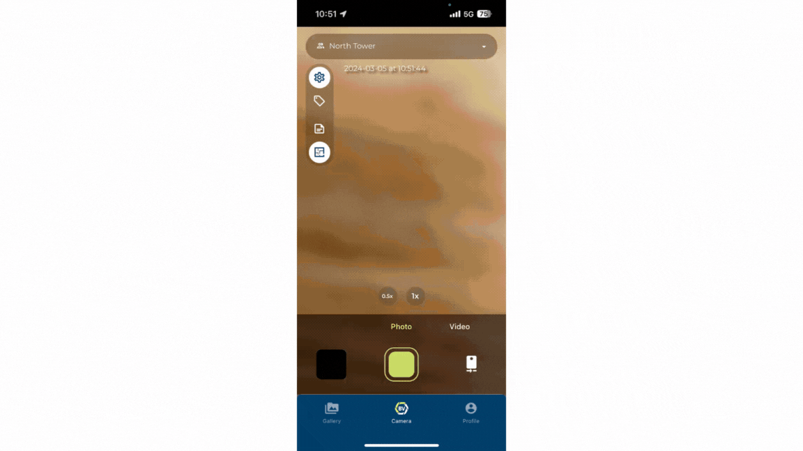

We have several safeguards in place to prevent loss of data, so as long as the app is still installed on the phone, you should be able to recover the photos.

## Pre-emptively: Back media up externally

This is a step you can take pre-emptively, if you have enough storage on your device. 

You can set up BuiltView to back up every photo you take to your external camera roll, so that there is a copy safe from app bugs and which can leverage Google Photos or iCloud backup.

To enable this feature, go to the Settings menu and check "Store media externally":

## If a photo is not uploading: Download

If you can find the photo in the app gallery but it won't upload to the web - either if it looks like it uploaded but didn't, or if it's showing an "upload error" message - you can export the photo to your normal Camera Roll.

To do this, either open a single photo and press the "download" icon at the top of the photo, or select multiple photos in the gallery view and press "Download" at the bottom of the page.  This should copy the selected photo/s to your external camera roll so you have a safe backup, and then you can either re-import the photo into the BuiltView app to trigger a new upload, or upload the photo through the web portal.

## If a photo is missing: Locate missing files

If you took a photo in the app but you cannot find it in the gallery on the phone, something may have gone wrong with tracking the media.

There are multiple ways to locate missing files. You can check your BV camera roll (accessible in the gallery), recently uploaded media items or your activity log (profile page) to see if it got uploaded. The BV camera roll shows only your captures and uploads, you can use filters to make your search faster! If you have set up Store media externally you should be able to find it manually and import it if you are unable to find it in recently uploaded media, activity log or the BV camera roll.

BV camera roll, recently uploaded media and the activity log are not available on Desktop. However, you can replicate the BV camera roll using the 'All photos and videos' team, and changing the uploader filter setting to only you. You can add additional filters to help you find missing files.
