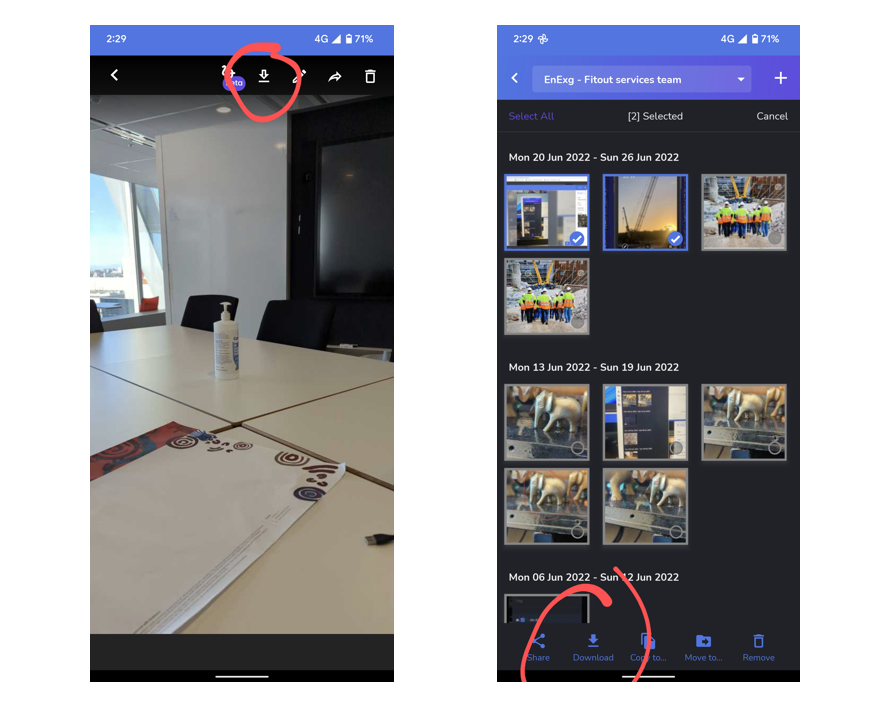
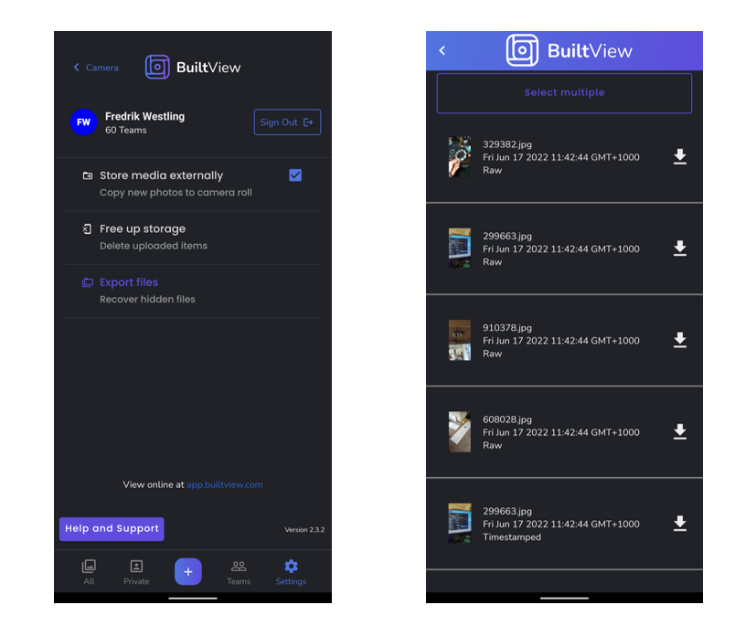

We're constantly working to improve the reliability of the BuiltView app, but occasionally a bug sneaks in, which can lead to photos disappearing from the app gallery or not appearing in the web gallery even if the app says they have been uploaded.

The good news is that we have several safeguards in place to prevent loss of data, so as long as the app is still installed on the phone, you should be able to recover the photos.

## Pre-emptively: Back media up externally

This is a step you can take pre-emptively, if you have enough storage on your device. 

You can set up BuiltView to back up every photo you take to your external camera roll, so that there is a copy safe from app bugs and which can leverage Google Photos or iCloud backup.

To enable this feature, go to the Settings menu and check "Store media externally":

## If a photo is not uploading: Export

If you can find the photo in the app gallery but it won't upload to the web - either if it looks like it uploaded but didn't, or if it's showing an "upload error" message - you can export the photo to your normal Camera Roll.

To do this, either open a single photo and press the "download" icon at the top of the photo, or select multiple photos in the gallery view and press "Download" at the bottom of the page.  This should copy the selected photo/s to your external camera roll so you have a safe backup, and then you can either re-import the photo into the BuiltView app to trigger a new upload, or upload the photo through the web portal.

## If a photo is missing: Locate missing files

If you took a photo in the app but you cannot find it in the gallery on the phone, something may have gone wrong with tracking the media.

However, we have built in a file browser so you can look through the original files as captured, and copy them over to your phone's Camera Roll.

Just go to the Settings page and find the "Export files" button. 

In the file browser, you can see a thumbnail of each photo and also the time it was taken; use this to find the missing photos.

Once you've found what you were looking for, either press the download icon here, or select multiple by pressing the button at the top, pressing the photos you want, and then pressing "Export".

The native share menu will appear, allowing you to save the photos to the Camera Roll, upload them to OneDrive, or send them via email or Teams.