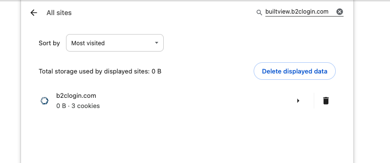
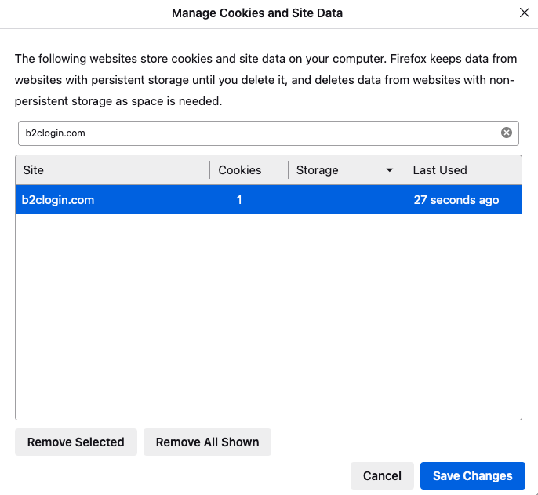
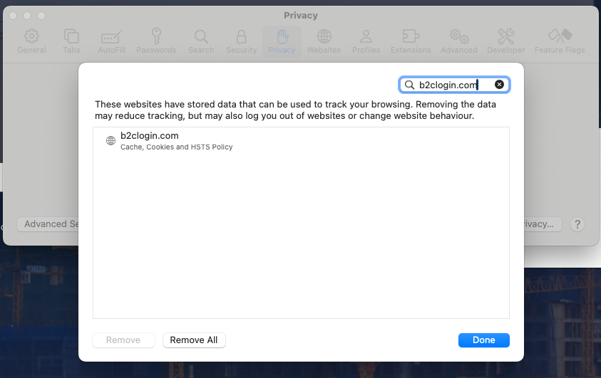

## The Problem

You can't sign in to BuiltView; specifically:

1. You press the "Login or Signup" button
1. Instead of being prompted for your email, it attempts to sign you in automatically, and fails.

You might see a page that looks like this:

## The Solution

In rare cases, a manual or automated logout procedure can fail, leading to a state where you aren't signed in but can't sign out. 

The best solution to this is to clear the cookies of the BuiltView login server builtview.b2clogin.com; this should ensure you are not being incorrectly handled.  Specific instructions are below, sorted by browser:

### Chrome

Go to browser settings, go to "Privacy and security" → "Third-party cookies" → "See all site data and permissions";   type "builtview.b2clogin.com" into the search bar, and press the bin icon for the listing labelled "b2clogin.com"

### Edge

Go to Edge settings, press "Cookies and Site Permissions" → "See all cookies and site data"; search "builtview.b2clogin.com" and delete the cookies in there.

### Firefox

Go to Firefox settings, enter the "Privacy & Security" tab, scroll down to "Cookies and Site Data", press the "Manage Data..." button, search for "b2clogin.com", select the entry and press "Remove Selected"

### Safari

Go to Safari Settings, click on the Privacy tab, then the "Manage Website Data..." button.  Search "b2clogin.com", select the entry and press "Remove".

