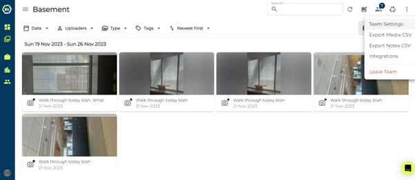
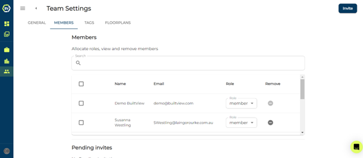
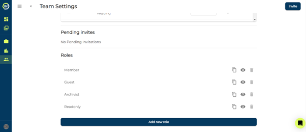
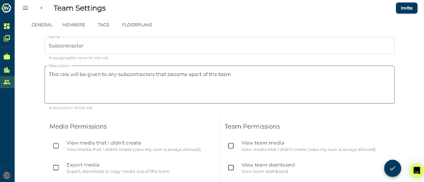
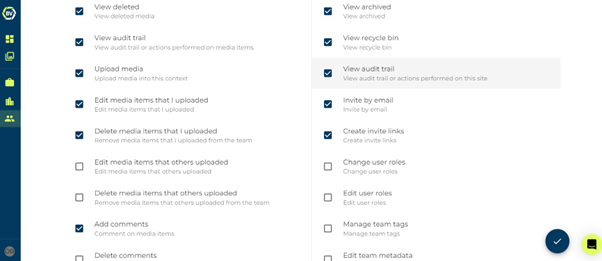
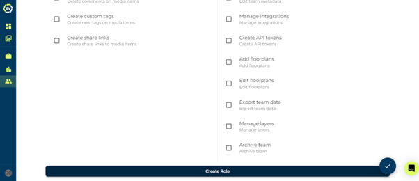

BuiltView allows you to create custom roles with specific permissions for each user. This allows you to control who can access certain features within your project and ensures that everyone has the right level of access to complete their tasks.

Using the custom role feature, you can add restrictions to specific users within the team, or limit particular actions for everyone. For example, if you don't want anyone in the team to be able to create custom tags (outside the approved Team Tags list), you can create a custom role with all permissions allowed except the option to create custom tags.

## Creating Custom Roles

Follow the steps below to create a custom role. 

1)	Access team settings at the top right of your team gallery

2)	Click the ‘Members’ tab.

3)	Scroll to the bottom of the page and click ‘Add new role’.

4)	Give the role a name and description.

5)	Select permissions you want to assign to the role.

6)	Scroll to the bottom of the page once you have set all the permissions and click ‘Create Role’

### Conclusion

Once you click ‘create role’ you can start assigning it to users! To do this go back to the members page, at the top you should see a list of all users apart of the team. Click on the user’s current role and switch it to the new role.

