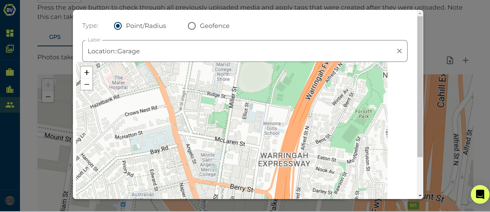

Geotagging is a relatively new feature Builtview has introduced. We want to make sure Builtview can continue to be invaluable as a searchable database without user’s spending extra time on site tours switching tags. As a way to streamline the application of tagging, geotagging was introduced. This is valuable for tags which are related to the GPS location.

To set-up geotagging you need access to the Tag page in your team’s setting.

1)	Access team settings in the top right corner of your team gallery

2)	Go to the ‘tags’ page in the settings.

You should see a input box of all your tags at start of the page content. Underneath this section is where you can add geotagging.

1)  Select either GPS or Floorplan for geotagging 

2)  Click the plus icon on the right of the screen

3)  Search for a tag to set up geofence

4)  Select the tag and choose each Point/Radius or Geofence 

5)  Using Point/Radius: Click on a point on the map, scroll to the bottom of the pop-up to adjust the radius

6)  Using Geofence: Use lines to create a box around the location to set the geofence

7)  Once you have set your boundaries, click save at the bottom of the pop-up!

Once you have clicked saved everything should work and photos taken within the boundaries will automatically have the tag selected.

