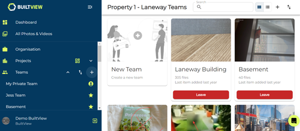
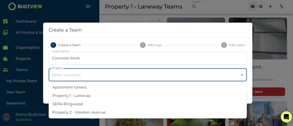

Creating a team lets you organise your files better and it is simple to do. You can do this is a few ways on desktop, such as when viewing all your teams, directly on the side navigation menu and in project teams. For this example, we will show you how to create a team from the navigation menu.

1)	Click the plus icon next to the Teams text on the side navigation menu on the left of the screen.

2)	Create a name for your team.

3)	Optionally, allocate your team to a project. This allows project members to join your team.

4)	Click create to continue.

Once you click create you can skip the rest of the steps – if you continue you can quickly set up the foundation of your team by creating tags and inviting users.

5)	Add some tags to the team.

Tags are an important aspect of creating a comprehensive and searchable photo record. We recommend creating up to 20 tags for users with folders. You can skip this stage and add tags later, learn how in the [Creating tags](https://support.builtview.com/teams-and-projects/5creating-tags) article.

6)	Invite users.

Don’t forget to invite users so you and your team can create a comprehensive record of onsite photos. You can skip this step and read the [Inviting Users](https://support.builtview.com/teams-and-projects/3inviting-users) article to learn how to invite users in different ways after a team has been created.

### Conclusion

Teams allow you to separate the stages and functions of your projects for a holistic and complete view providing an invaluable on-site photo record.

Learn to create a team on mobile in the [Mobile Help](https://support.builtview.com/mobile-help/2creating-team) article collection.
