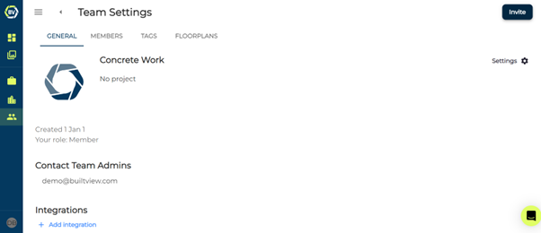

Invite your site team and let them capture and upload content in Builtview.

1)	Access team settings on the top right of your team gallery

2)	Click the invite button at the top right of the team settings page.

3)	Select how you would like to invite users.

You have the option to invite users by email, other teams you are apart of, link, QR code or .txt file.

- **Email**: enter the email addresses of the user’s you want to invite to your team and select a role. You can also include an invite message!
- **Teams**: Invite all users that are in a team you are also apart of and select an initial role for them. You can also include an invite message.
- **Link**: Select a role and copy the invite link or generate a QR code to send to your users
- **.Txt file**: As a way to invite a large number of users to a team, you can do this with a .txt file, if formatted correctly “email,role.” You can also include an invite message!

Learn how to invite on mobile in the [Mobile Help](https://support.builtview.com/mobile-help/inviting-users) article collection.
