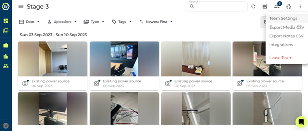
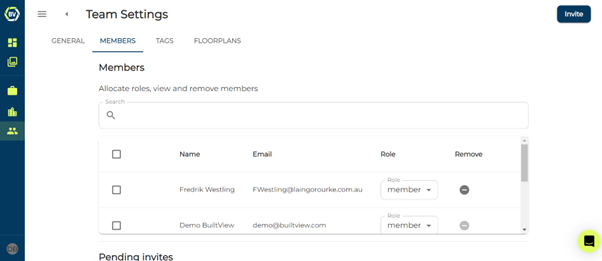
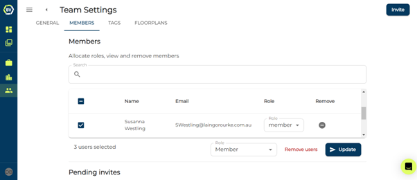
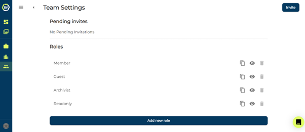

For effective record management for your onsite photos, you need to manage members properly. This includes removing user’s and changing roles or permissions.

1)	Access your team settings at the top right of your team gallery.

2)	Go to the members tab.

3)	Manage your members.

From this page, you can search to locate team members, change roles, and remove users. You can change roles or remove multiple users at a time by making your user selection and changes and clicking update to save.

4)	User roles and permissions

You can also view the roles apart of your team. If you are a member, you can change the role permissions or create new roles. <em>This is not recommended as it can impacts the quality of your record keeping if permissions are not set correctly.</em> To learn more about user permissions and creating new roles check out the [Creating new user roles](https://support.builtview.com/team-management-and-advanced-features/creating-roles) article.

