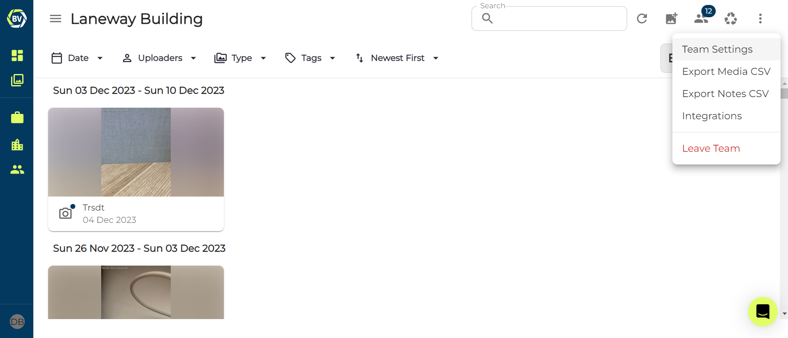

What makes Builtview different from other photo management software is the tag system. It is an easy and quick way for users to categorise their photos with little effort. However, the effectiveness of this system is dependent on how it is set up. In a small team, you can get away with allowing users to create tags as they need, but in larger teams this needs to be organised. 

1)	Access your team settings at the top right of your team gallery.

2)	Go to the ‘tags’ tab.

3)  Enter the name of a tag in the input box and create!

4)  Click save

Make sure you create enough tags which can be used within the context of your team. We recommend around 20 tags for your team to prevent your categorisations from becoming too complicated.

It can be hard to create tags which are best for your team, having other members apart of your team can help make sure your team is still organised with enough tags for your members to utilise.
