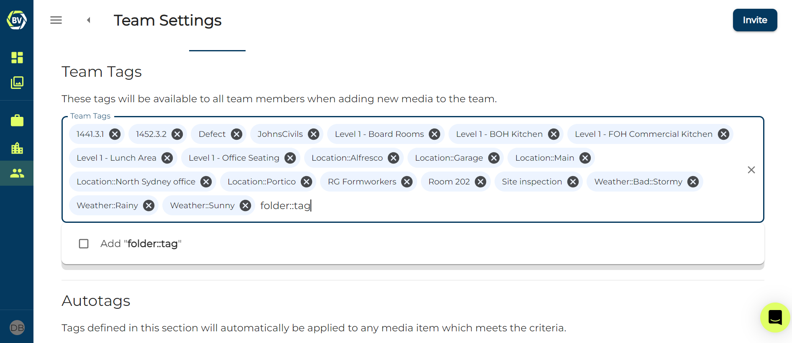
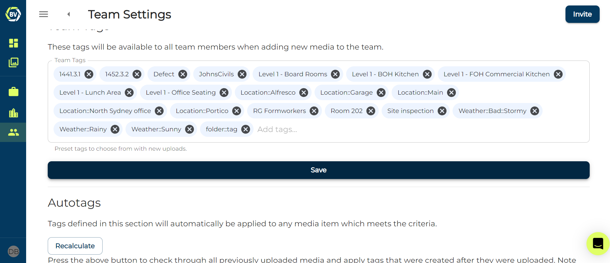
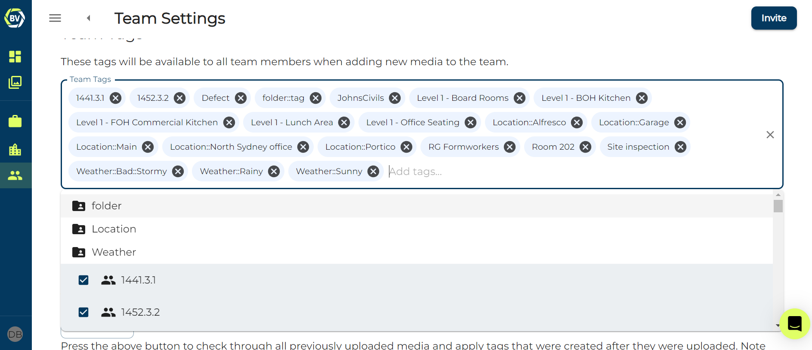
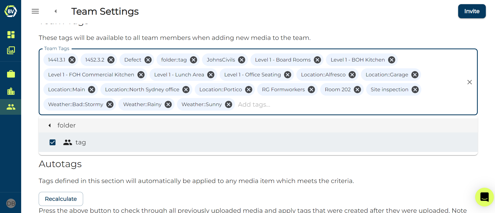
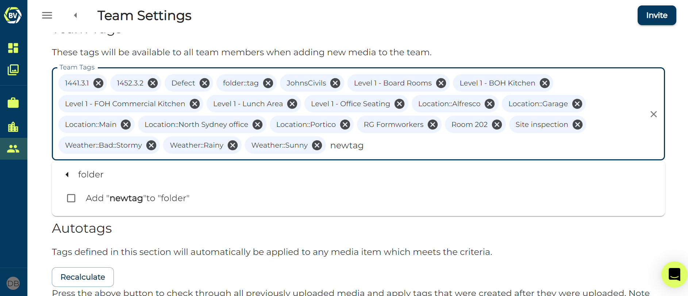
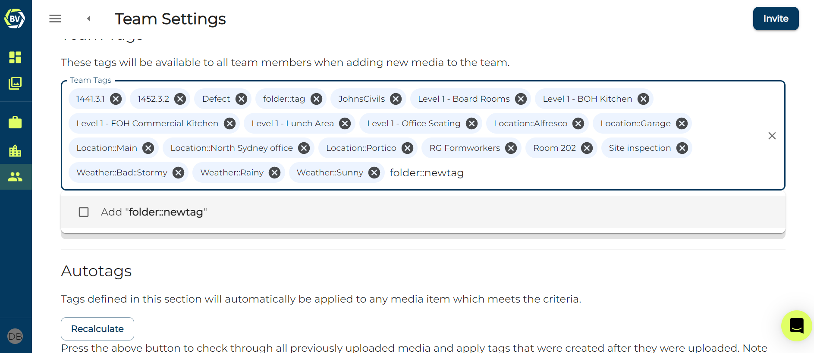
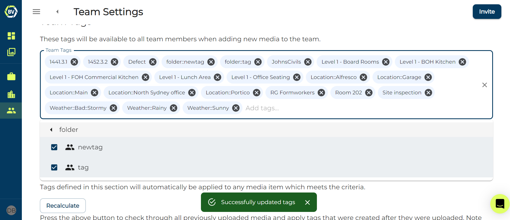

Managing tags is vital in large teams to ensure effective record management. Without this, 100s of tags will be used by your team making it difficult to both find the correct tag when capturing and finding media later. 

1)	Access your team settings at the top right of your gallery.

2)	Go to the ‘tags’ tab.

From this page you will be able to create and manage your tags.

## Creating tag folders

Tag folders are a good way to organise your tags, some tags which for example describe the weather can be categorised into a ‘Weather’ folder making it easier for users to find when capturing. In order to do this you need to use the code 'foldername::tagname'

1)  Open the tag input box and use the shorthand 'foldername::tagname' and click add below the input box

2)  Click save

You should now be able to see the folder listed when you click on the input box

You can click on the folder to see the tags 

# Adding tags to tag folders

There are two ways to add tags into existing folders.

1) Click on the tag folder from the list which open when you click on the input box, write a new tag, click add and click save.

2) Use the same method for creating a new folder, with the shorthand "folder::newtag", click add  and click save.

You should be able to see it in the tag folder once you have saved 

