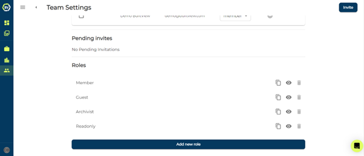

By Default, there are four roles in each team. You can find this at the bottom of the ‘members’ tab in the team settings. You are not able to delete these roles, but you can view the permissions or duplicate them.

-	**Member**: Members have access to all permissions in the team, they are in-charge of setting up the standard for record keeping through tag management, uploading floorplans and KML maps.
-	**Guest**: Guests are regular users, they utilise the tags created alongside timestamps, GPS and more when uploading media. They can interact and edit media freely that they create.
-	**Archivist**: Archivist filter, search and locate media items in the team record and create site reports, they can see archived and deleted media as well. They are unable to make any changes which could impact the record or upload. This is usually given to clients or users after a project is completed.
-	**Read-Only**: Read-Only and Archivist roles are similar, however Read-Only are unable to see who uploaded content, deleted, or archived content. They can view the gallery but cannot interact. 

To learn more about user permissions and creating more roles, check out the [Creating user roles](https://support.builtview.com/team-management-and-advanced-features/creating-roles/) article.
