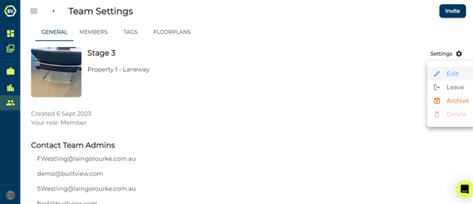

# Managing Teams

You are able to manage your team in the team’s settings. This is accessible in the top right of the team gallery page in the ‘general’ tab. You can edit your team, leave, delete and archive.

### Editing Teams
In the team settings you can edit the name, display picture and associated project for the team. 

### Leaving Teams
You are able the leave a team if you are not the last member left on the team.

### Deleting Teams
You can delete teams in the team settings. You are only able to do this if there are no media items in the team. We do not recommend deleting a team unless it was created by accident, or you are re-organising your onsite photos. <em>Archiving</em> is a better way to maintain your photo records without permanently deleting them.

### Archiving Teams
Archiving is a great way to maintain onsite photo evidence for your progression onsite. Archiving will mean no user can upload any more content, maintaining the record and quality of the onsite evidence. 
