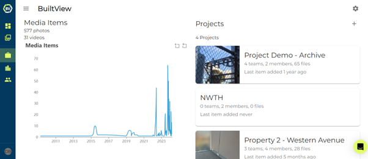
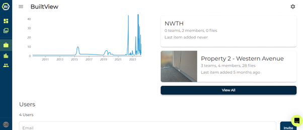
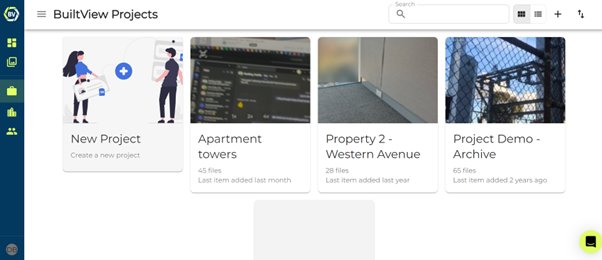
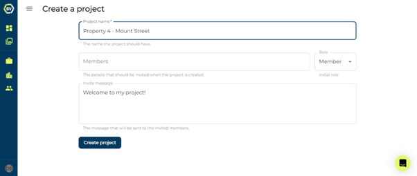

To create a project, you need access to your organisation’s page. If you do not have access, you are unable to create a project.

1)	Go to your organisation dashboard page, accessible in the side navigation menu.

2)	Click on ‘view all’ under projects.

3)	Click the New Project box or ‘+’ icon at the top right of the screen.

4)	Add a name for your project, add some initial members and create.

### Conclusion
Now that you have created your project, you need to add teams into it and start inviting users to those teams! User’s do not need to be invited to the project unless you want them to have additional permissions in project teams and freely join and leave.
