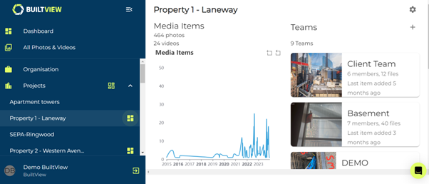
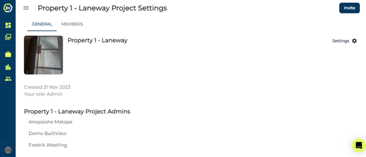

Similar for teams, you can edit the name of your project and the display picture, making it easier for your users to recognise your project. You are only able to access project settings if you have access to the project dashboard.

1)	To access the project dashboard, click this icon on the right of the project name on the side navigation menu.

2)	Access your project settings at the top right of the dashboard, this should open automatically on the ‘general’ settings tab.

### Edit Project Information
In the project settings you can edit the name and display picture of the project.

### Leaving Projects
You are able the leave a project if you are not the last member left.

### Deleting Projects
You can delete projects in the project settings. We do not recommend deleting a project unless it was created by accident, or you are re-organising your records. Archiving is a better way to maintain your photo records without permanently deleting them.

### Archiving Projects
Archiving is a great way to maintain onsite photo evidence for your progression onsite. Archiving will mean no user can upload any more content or create more teams - maintaining the record and quality of the onsite evidence. 
