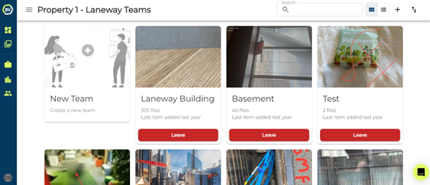
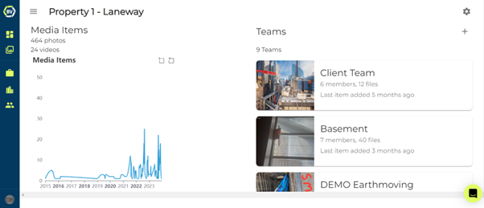
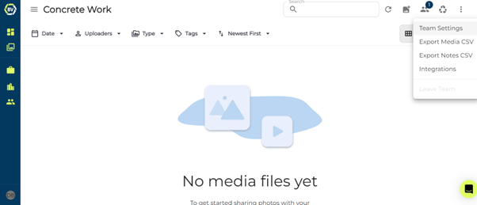
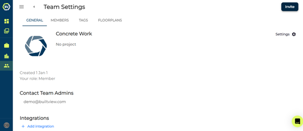
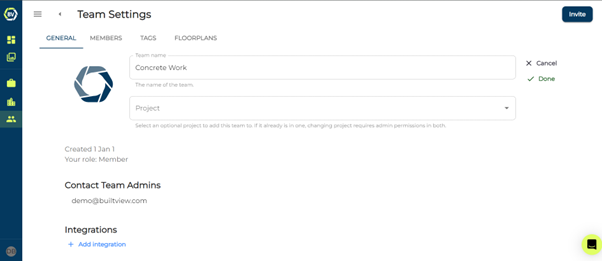
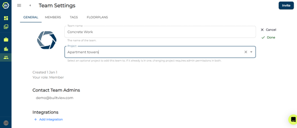

# Intro to Teams and Projects

Teams are a great way to organise and store your onsite photos for effective record management. Based on the size of your site project you can separate your site progression in stages or different sections with teams. You can connect these teams in a project, making it easy to see onsite progress across multiple teams. 

As a project admin you are able to view your project dashboard.

## How do you assign existing teams to projects?

1)	Access team settings on the top right of your team gallery.

2)	Click the settings button on the right and click edit.

3)	Click the project input box and select the project.

4)	Click done to save the changes.

### Conclusion

This team will now be linked to your project. All users in your project will be able to join or leave this team and data will be connected to your project dashboard.

When you are creating a new team, you can link it straight away to a project. Read the article [Creating a team](https://support.builtview.com/teams-and-projects/creating-team) to learn how.
