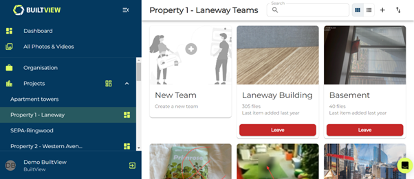

# Managing Project Teams

If you are a part of a project, you can access the teams associated with it. 

1)	Click your project on the side navigation menu to see all teams associated with the project.

### Conclusion

From this page you can leave and join project teams. If you want to make a team linked to a project this is accessible in the team’s settings, learn how to in [Intro to teams and projects](https://support.builtview.com/teams-and-projects/intro/) article.
