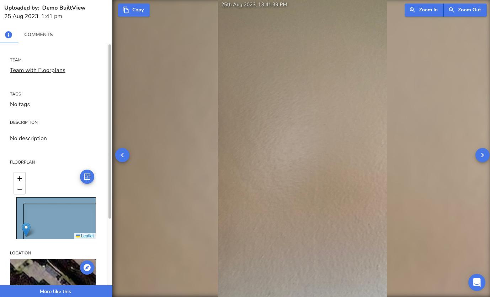
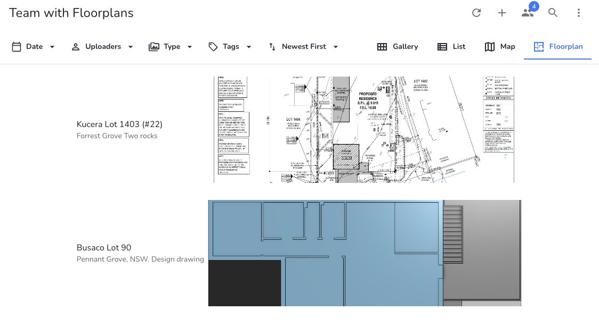
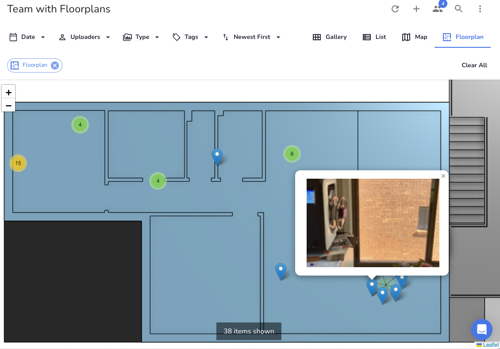

## Floorplan structures
The floorplan feature in BuiltView is designed to help you localise your visual data in situations where GPS is unusable or insufficient - for example, when working underground or on multi-level vertical builds.

You can upload floorplans to any team if you have sufficient permissions, and each team can have multiple floorplans, so you can have a separate file for each level of a building for example.

Currently, floorplans are supported as image files or as PDF files - in the latter case, only the first page of the PDF will be used to render the floorplan image.

Media items can then be allocated to specific locations on particular floorplans, and you can view your photos in the same way as you can on a map using GPS locations.

## Using floorplans in the BuiltView web app

### Uploading Floorplans

With BuiltView, you can easily upload your floorplans to the web portal. Here's how to do it:

1. Go to a team page and press Team Settings
1. Click on Floorplans tab in the settings page.  This page is where you can see all the floorplans you've uploaded, as well as upload new ones.
1. Click on Upload new floorplan to open the upload form.
1. Provide a title for the floorplan, as well as an optional description to help your eam members understand what this floorplan is.  You can also specify a version name, though if you do not a default one will be created based on the upload date.  You can also specify a project to add the floorplan to the project library, so if that floorplan is useful across multiple teams in the same project, do that as well.
1. Select the floorplan file you want to upload.  This can be an image file, or a PDF in which case the first page will be used to render the floorplan.
1. Press the "Create floorplan" button

Once you've uploaded your floorplan and can see it in the list of floorplans in the floorplan tab, you can begin using it in the BuiltView mobile app.

### Editing media item floorplan locations in the web app

If a media item has a floorplan location, you will see it when viewing the media item in the gallery:

In order to add or edit the location of a media item on a floorplan, switch to media item edit mode.  Here, you can select which of the team's floorplans you want to use, and then click on the floorplan to nominate the location.

When you save your changes by pressing the **Submit** button, the location should update automatically, though you may need to refresh the page to update the display.

### Adding floorplan location to a media item

Note the process is exactly the same for editing the location on a media item which already has one.

### Viewing media items on the floorplans in the team gallery

In teams that have floorplans uploaded, you can go to the Floorplan tab in the team gallery to see a list of floorplans you can view.

If you click on one of the floorplans, the floorplan filter will be set and you will be taken to the floorplan map view.  In this view, all media items that were allocated to this floorplan (and match the current filters) will be shown in a cluster view.  By clicking on any media item, you will be taken to the media item view to see more.

Remember that you can use **Date**, **Uploader** or **Tag filters** to narrow down the results if there are too many visible.

When you select a floorplan, you will see all the media items that have been located on that floorplan.  You can click on the media items to view them, and you can also click on the floorplan to zoom in and out.

## Using Floorplans in the BuiltView Mobile App

To use the floorplan feature, you need to be on BuiltView version 3.2.0 or later.

The BuiltView mobile app allows you to pre-fill your floorplan location so you can take one or more photos and automatically link them to where they are.

As with other pre-fills, the floorplan can be accessed directly from the camera screen (the middle icon on the left).  When you press that button, if there are uploaded floorplans, you will be prompted to select which one you are currently on (this defaults to the last one used). 

Then, you simply zoom in to the floorplan, pan to where you are and tap the location to set your current position.  Press "Save" to finish the prefill.  Now, every photo you take will be allocated to that location.

If you press the prefill again, you will automatically be on the same floorplan, and a grey circle will indicate where you last were, so you can easily update your position for your next set of photos.

!!! warning
    the floorplan location will stay prefilled until the app is closed, so if you're walking around you need to remember to clear the floorplan location or risk having photos misrepresented.

This feature is especially useful for documenting progress on construction projects, as you can easily see where each photo was taken on the floorplan.

## Conclusion

Uploading floorplans to BuiltView's web portal and using them in the mobile app is a great way to keep track of progress on your construction projects. By specifying where each photo was taken on the floorplan, you can easily see how your project is progressing and identify any issues that need to be addressed.

