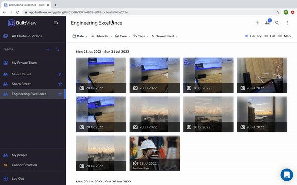

BuiltView is for teams - the more the merrier! 
Creating a team is easy as 1-2-3:

## Web

1. Click the plus icon + in the teams section of the sidebar. 
2. Fill in the details in the pop up window. Team tags and team members can be added here too. 
3. Hit 'Create Team' and you're done! Start sharing images and videos in real time with your team.

## Mobile

1. Tap the gallery icon on the bottom left of the bottom bar. 
1. Then tap the top right plus icon to open the 'Create New Team' screen. 
1. Add in your team name and tags then press 'Create Team'. 
1. To add team members, locate your new team in the list and tap the three dots on the right hand side.
1. Select the option to 'Invite Members' and follow the prompts to add team members however you see best fit. 