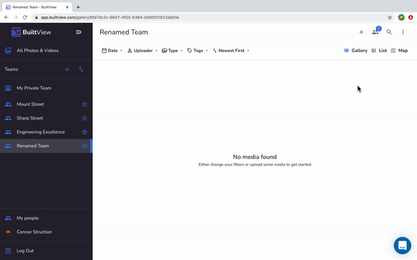

## Web

**To delete a team, there must be no media items and you must be the only member.**

1. Click the three dot menu on the top right corner. 
1. Hit the 'Edit Team' option from the drop down. 
1. Click the 'Delete Team' button at the bottom of the pop up. 

