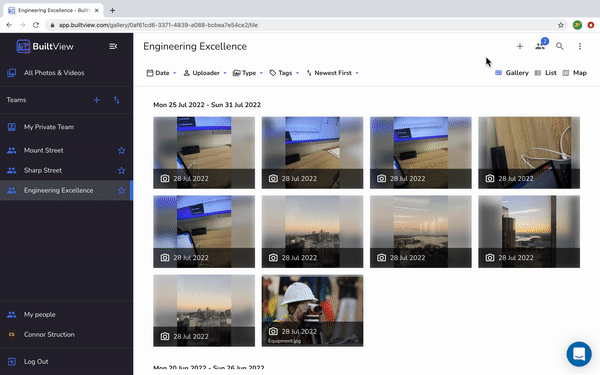

## Web

To invite someone to your team follow these steps:

1. Click the 'Team Members' icon along the top bar on the right. 

2. Once a window showing all your current team members appears, type in the email of who you would like to invite. If the team member you wish to add is already in another team with you, the dropdown menu will have their name.

Alternatively, you can click the 'Invite by link' button which will generate a link you can share with others to have them join your BuiltView team.

## Mobile

1. Tap the gallery icon along the left side of the bottom bar.
2. Find the team you want to add new members to and press the three dots on the right side.
3. Select the 'Invite Members' option and either share the invite link, add members directly by email or go via your phone's contacts. 