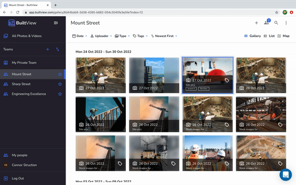

## Web

1. Select media by hovering over the top left corner of the thumbnail until a button appears. 
2. Click on 'Move to...' in the top bar. 
3. Choose the team from the drop down list to move the media into and ta-da your file(s) will be transferred! 

## Mobile

1. Open the gallery and long hold on the thumbnail of the media item(s) you want to move. 
2. Tap 'Move to' along the bottom bar. 
3. Select the team where your media items should go. 