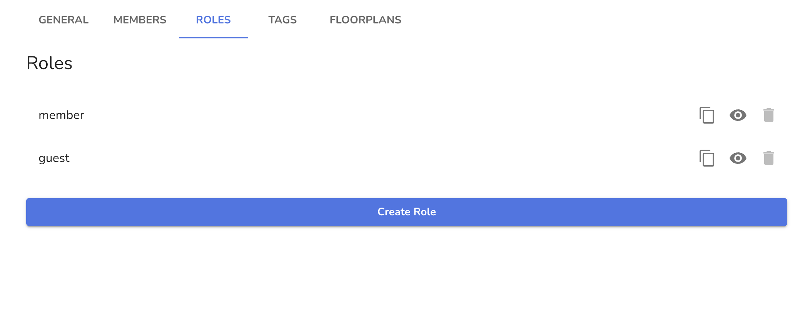
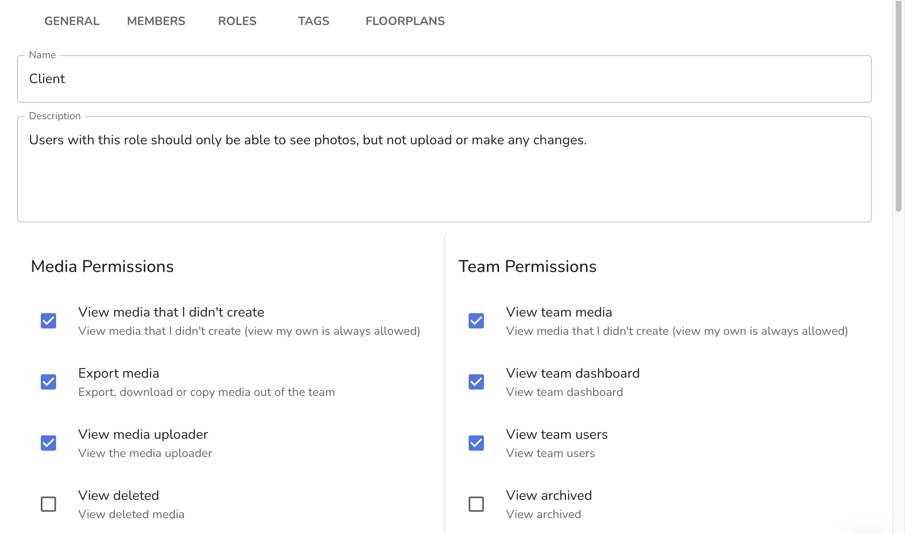
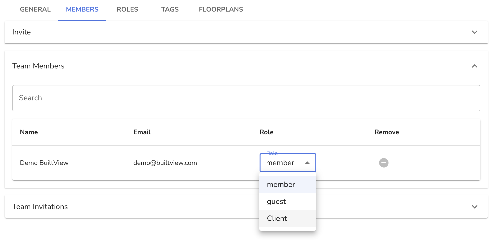
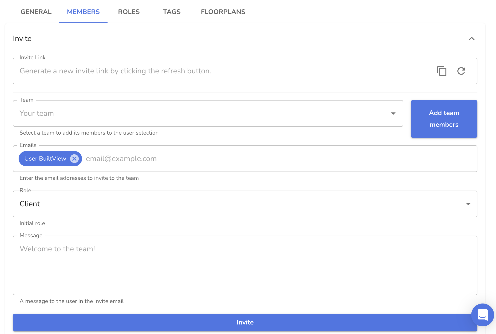

## Setting up Granular User Permissions in BuiltView

BuiltView allows you to create custom roles with specific permissions for each user. This allows you to control who can access certain features within your project and ensures that everyone has the right level of access to complete their tasks.

Using the custom role feature, you can add restrictions to specific users within the team, or limit particular actions for everyone.  For example, if you don't want anyone in the team to be able to create custom tags (outside the approved Team Tags list), you can create a custom role with all permissions allowed except the option to create custom tags.

## Creating Custom Roles

To create a custom role, go to the **Team Settings** page and click on **Roles**. From there, click on **Create Role**.  You can also duplicate an existing role if you just want to slightly vary existing roles.

By default, teams have two roles - member and guest.  Members can do everything in a team, while guests can only view and upload content (they cannot edit or delete existing content that they did not upload).

You can then give the role a name and a description, to help you remember what the role represents and when it should be used.

Next, select the permissions you want to assign to the role. This can include permissions for viewing or editing specific items in a project, as well as permissions for creating or deleting items.

Permissions fall into four categories: media, team, project and organisation.  For a team member, only media and team are relevant.

## Assigning Roles to Users

Once you have created your custom roles, you can assign them to users in your team. To do this, go to the **Members** tab in the team settings and click on the user that you want to assign a role to. From there, select the **Roles** tab and click on **Add Role**. You can then select the role you want to assign to the user.

You can also invite new users with the created role

## Project user roles

In the same way as with teams, you can create custom roles for project users.  When you do this, you can also specify media and team permissions as well as project permissions, and these will then cascade down to all teams within the project.  So, if you assign all users in a project to a custom role which does not include the "Create custom tags" permission, then no user in any team within the project will be able to add tags that aren't in the approved team tags list, regardless of their team role.

## Conclusion

By setting up granular user permissions in BuiltView, you can ensure that everyone in your project has the right level of access to complete their tasks. Whether you need to control who can view certain items or who can edit specific parts of your project, custom roles can help you achieve your goals.